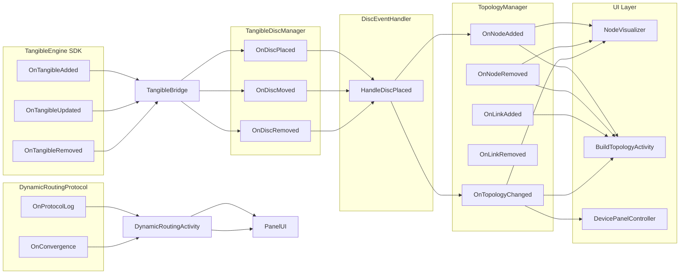

# API — Catálogo de Eventos

> **Propósito**: Lista completa de eventos del sistema, publicadores y suscriptores.

---

## TopologyManager Events

| Evento | Tipo | Publicador | Suscriptores |
|--------|------|------------|--------------|
| `OnNodeAdded` | `Action<NetworkNode>` | `AddNode()` | `NodeVisualizer`, `BuildTopologyActivity`, `SceneSetup` |
| `OnNodeRemoved` | `Action<NetworkNode>` | `RemoveNode()` | `NodeVisualizer`, `BuildTopologyActivity` |
| `OnLinkAdded` | `Action<NetworkLink>` | `AddLink()` | `BuildTopologyActivity` |
| `OnLinkRemoved` | `Action<NetworkLink>` | `RemoveLink()` | — (no listeners directos) |
| `OnTopologyChanged` | `Action` | Todos los anteriores | `SceneSetup` → `DevicePanelController`, `NodeVisualizer`, `BuildTopologyActivity` |

## TangibleDiscManager Events

| Evento | Tipo | Publicador | Suscriptores |
|--------|------|------------|--------------|
| `OnDiscPlaced` | `Action<int, Vector2>` | `SimulateDiscPlaced()` | `DiscEventHandler` |
| `OnDiscMoved` | `Action<int, Vector2>` | `UpdateDiscPosition()` | `DiscEventHandler` |
| `OnDiscRemoved` | `Action<int>` | `SimulateDiscRemoved()` | `DiscEventHandler` |

## TangibleEngine Events (SDK Externo)

| Evento | Tipo | Publicador | Suscriptores |
|--------|------|------------|--------------|
| `TE.OnTangibleAdded` | `Action<Tangible>` | TangibleEngine Service | `TangibleBridge` |
| `TE.OnTangibleRemoved` | `Action<Tangible>` | TangibleEngine Service | `TangibleBridge` |
| `TE.OnTangibleUpdated` | `Action<Tangible>` | TangibleEngine Service | `TangibleBridge` |

> Estos eventos vienen del SDK externo `TangibleEngine` (en `Assets/TangibleEngine/`). El sistema se suscribe a ellos en el `Awake()` de `TangibleBridge`.

## DynamicRoutingProtocol Events

| Evento | Tipo | Publicador | Suscriptores |
|--------|------|------------|--------------|
| `OnProtocolLog` | `Action<string>` | `RunProtocolLoop()` | `DynamicRoutingActivity` (lambdas → panel UI) |
| `OnConvergence` | `Action` | `RunProtocolLoop()` | `DynamicRoutingActivity` (lambdas → panel UI) |

## Diagrama de Flujo de Eventos



## Reglas de Subscripción

1. **Siempre desuscribirse en `OnDestroy()`** para evitar `MissingReferenceException`:

```csharp
private void OnDestroy() {
    if (topologyManager != null) {
        topologyManager.OnNodeAdded -= OnNodeAdded;
        topologyManager.OnTopologyChanged -= OnTopologyChanged;
    }
}
```

2. **Los lambdas capturan variables**: Usar variable local para evitar null:

```csharp
int capturedDiscId = node.DiscId;
AddClickEvent(trigger, () => OnNodeClicked(capturedDiscId));
```

3. **Eventos con `?.Invoke()`**: Todos los eventos usan el patrón seguro:

```csharp
OnNodeAdded?.Invoke(node);
OnTopologyChanged?.Invoke();
```
