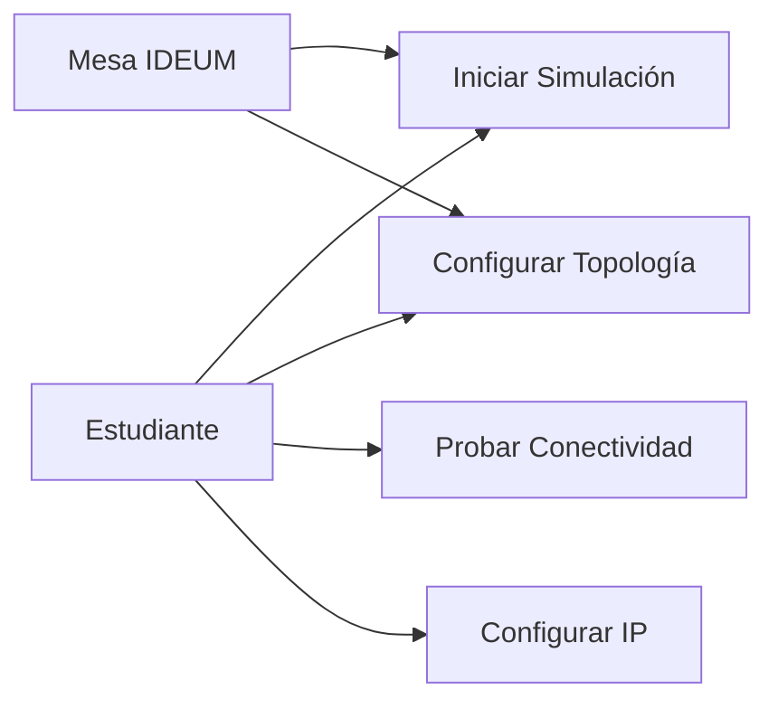
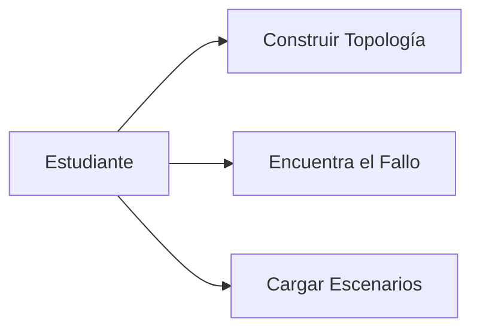
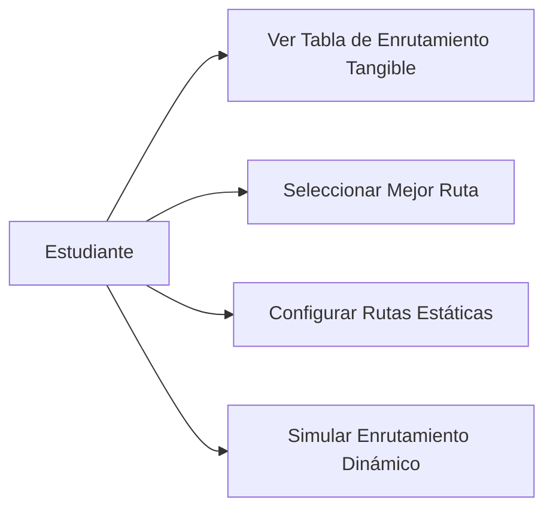
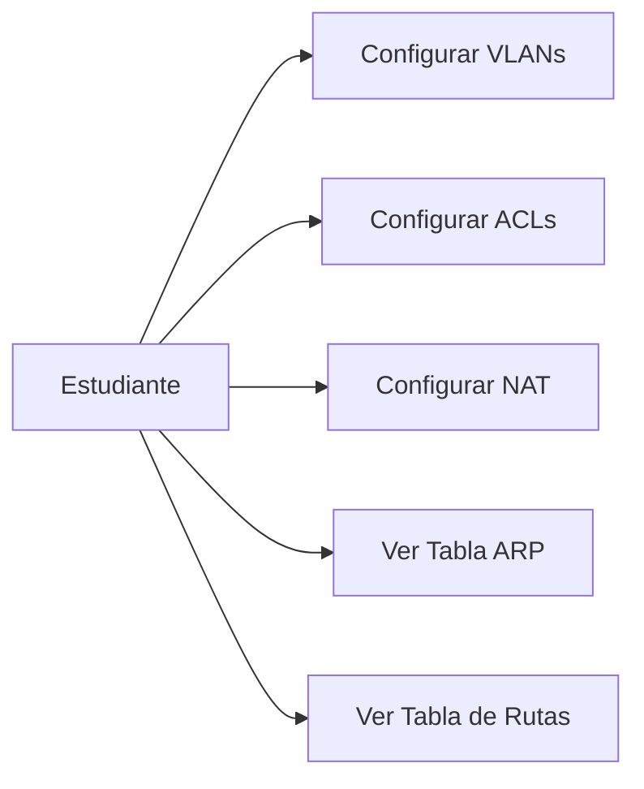
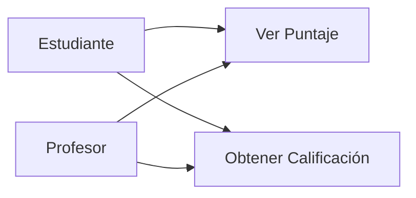

# DC-01: Diagramas de Casos de Uso

> **Propósito**: Mostrar la interacción entre los actores del sistema y las funcionalidades del SimuladorRedes IDEUM.
> **Distribución**: Actor a la izquierda, casos de uso a la derecha. Cada diagrama agrupa funcionalidades relacionadas.

---

## DC-01a: Gestión de Simulación

---

## DC-01b: Actividades Académicas

---

## DC-01c: Enrutamiento

---

## DC-01d: Configuración Avanzada de Red

---

## DC-01e: Sistema de Evaluación

---

## Leyenda de Actores

| Actor | Descripción |
|-------|-------------|
| **Estudiante** | Usuario final que interactúa con la mesa IDEUM |
| **Profesor** | Supervisor que puede ver calificaciones |
| **Mesa IDEUM** | Sistema de discos físicos que envía eventos táctiles |

## Archivos Relacionados

- `Assets/Scripts/Simulation/SceneSetup.cs` — Orquestador de la escena
- `Assets/Scripts/Simulation/ActivityLoader.cs` — Carga de actividades
- `Assets/Scripts/Simulation/ScoringSystem.cs` — Sistema de puntajes
