# DC-01: Diagrama de Casos de Uso

> **Propósito**: Mostrar la interacción entre los actores del sistema y las funcionalidades principales del SimuladorRedes IDEUM.

```mermaid
graph TB
  subgraph Actores
    E[Estudiante]
    P[Profesor]
    M[Mesa IDEUM]
  end

  subgraph "SimuladorRedes IDEUM"
    subgraph "Gestión de Simulación"
      UC1[Iniciar Simulación]
      UC2[Configurar Topología]
      UC3[Probar Conectividad]
      UC4[Configurar IP]
    end

    subgraph "Actividades Académicas"
      UC5[Construir Topología]
      UC6[Encuentra el Fallo]

      UC7[Ver Tabla de Enrutamiento Tangible]

      UC8[Seleccionar Mejor Ruta - Simulación]
      UC9[Configurar Rutas Estáticas]
      UC10[Simular Enrutamiento Dinámico]
      UC11[Cargar Escenarios]
    end

    subgraph "Configuración Avanzada"
      UC12[Configurar VLANs]
      UC13[Configurar ACLs]
      UC14[Configurar NAT]
      UC15[Ver Tabla ARP]
      UC16[Ver Tabla de Rutas]
    end

    subgraph "Sistema de Evaluación"
      UC17[Ver Puntaje]
      UC18[Obtener Calificación]
    end
  end

  E --> UC1
  E --> UC2
  E --> UC3
  E --> UC4
  E --> UC5
  E --> UC6
  E --> UC7
  E --> UC8
  E --> UC9
  E --> UC10
  E --> UC11
  E --> UC12
  E --> UC13
  E --> UC14
  E --> UC15
  E --> UC16
  E --> UC17
  E --> UC18

  P --> UC17
  P --> UC18

  M --> UC1
  M --> UC2
```

## Leyenda

| Elemento | Descripción |
|----------|-------------|
| **Estudiante** | Usuario final que interactúa con la mesa IDEUM |
| **Profesor** | Supervisor que puede ver calificaciones |
| **Mesa IDEUM** | Sistema de discos físicos que envía eventos táctiles |

## Archivos Relacionados

- `Assets/Scripts/Simulation/SceneSetup.cs` — Orquestador de la escena
- `Assets/Scripts/Simulation/ActivityLoader.cs` — Carga de actividades
- `Assets/Scripts/Simulation/ScoringSystem.cs` — Sistema de puntajes
