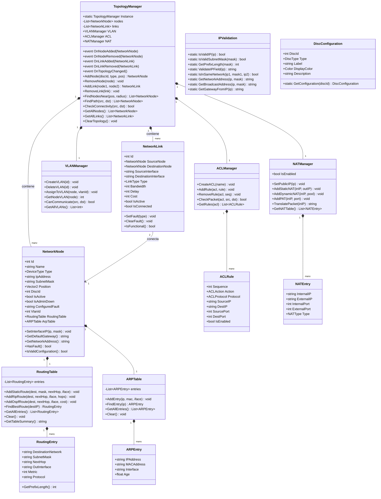

# DC-02: Diagrama de Clases — Network Layer

> **Propósito**: Mostrar la estructura del núcleo de networking: nodos, enlaces, tablas de enrutamiento, y managers de red.

## Archivos Relacionados

| Archivo | Namespace |
|---------|-----------|
| `Assets/Scripts/Network/TopologyManager.cs` | `SimRedes.Network` |
| `Assets/Scripts/Network/NetworkNode.cs` | `SimRedes.Network` |
| `Assets/Scripts/Network/NetworkLink.cs` | `SimRedes.Network` |
| `Assets/Scripts/Network/RoutingTable.cs` | `SimRedes.Network` |
| `Assets/Scripts/Network/ARPTable.cs` | `SimRedes.Network` |
| `Assets/Scripts/Network/IPValidation.cs` | `SimRedes.Network` |
| `Assets/Scripts/Network/DiscConfiguration.cs` | `SimRedes.Network` |
| `Assets/Scripts/Network/VLANManager.cs` | `SimRedes.Network` |
| `Assets/Scripts/Network/ACLManager.cs` | `SimRedes.Network` |
| `Assets/Scripts/Network/NATManager.cs` | `SimRedes.Network` |
