# DC-04: Diagrama de Clases — Simulation Layer

> **Propósito**: Mostrar la estructura del orquestador de escena, el cargador de actividades, el sistema de limpieza, las 7 actividades académicas, el sistema de puntajes y el protocolo de enrutamiento dinámico.

```mermaid
classDiagram
    class SceneSetup {
        -Canvas canvas
        -Camera cam
        +SetupScene() void
        +SetupManagers() void
        +CreateVisualizer() void
        +CreateMainMenu() void
        +DestroyMainMenu() void
        +DestroyPreviousPanels() void
        +StartSimulation() void
        +ShowActivities() void
        +ShowConnectivity() void
        +ShowInstructions() void
        +ToggleLinkMode(mode) void
        +HandleNodeClick(discId) void
    }

    class ActivityLoader {
        +SelectActivity(index) void
        +StartSimulation(canvas) void
        +ShowConnectivityPanel() void
        +GoBackToMainMenu() void
        +LoadScenario(index) void
        +StartDynamicProtocol(panel) void
        +StopDynamicProtocol() void
        +ClearDynamicRoutes() void
    }

    class SceneCleanupService {
        +static SceneCleanupService Instance
        +ClearSimulation(topology, visualizer, discSim) void
        +GoBackToMainMenu(canvas, callback) void
        +ExitApplication() void
    }

    class SimulationControls {
        +ExecutePing() void
        +RemoveSelectedNode() void
        +GoBackToMainMenu() void
    }

    class BuildTopologyActivity {
        +DetectTopologyType() TopologyType
        +UpdateUI() void
        +IsFullyConnected() bool
    }

    class FindFaultActivity {
        +OnSolveClicked() void
        +FixFault() void
        +ValidateSolution() bool
        +GenerateRandomFault() void
        +GenerateNewScenario() void
    }

    class RoutingTablesActivity {
        +RefreshRoutingTables() void
        +GenerateSampleRoutes(router) void
        +GetRouterTableSummary() string
    }

    class BestRouteActivity {
        +NextScenario() void
        +OnRouteSelected(index) void
        +ShowScenario(index) void
    }

    class StaticRoutingActivity {
        +AddRoute(dest, mask, nextHop) void
        +AddSampleRoute() void
        +TestRouting() void
    }

    class DynamicRoutingActivity {
        +SetProtocol(type) void
        +SimulateAdvertisement() void
        +SimulateConvergence() void
    }

    class PredefinedScenarios {
        +static PredefinedScenarios Instance
        +GetScenarios() List~NetworkScenario~
        +GetScenario(index) NetworkScenario
    }

    class DynamicRoutingProtocol {
        -ProtocolType protocol
        -float advertisementInterval
        -bool isRunning
        -bool isConverged
        -int advertisementCount
        +event OnProtocolLog(string)
        +event OnConvergence()
        +StartProtocol() void
        +StopProtocol() void
        +IsRunning() bool
        +IsConverged() bool
        +ClearAllRoutes() void
    }

    class ScoringSystem {
        +static ScoringSystem Instance
        +StartSession(activityName) void
        +AddTaskCompleted() void
        +AddFaultFound() void
        +AddRouteConfigured() void
        +AddPingSuccess() void
        +AddPenalty(reason, pts) void
        +GetCurrentScore() int
        +GetSessionSummary() string
        +GetGrade() int
        +EndSession() void
    }

    class RoutingSimulator {
        +static SetProtocol(type) void
        +static SimulateRIPAdvertisement(router) void
        +static SimulateOSPFAdvertisement(router) void
        +static SimulatePacketForwarding(router, dst) void
        +static GetRoutingTableSummary(router) string
    }

    class PathCalculation {
        +static CalculateShortestPath(graph, start, end) List~NetworkNode~
        +static IsLongestPrefixMatch() bool
    }

    class GameManager {
        +static GameManager Instance
        +GetTopologyManager() TopologyManager
        +ResetSimulation() void
    }

    SceneSetup --> ActivityLoader : delega
    SceneSetup --> SceneCleanupService : delega limpieza
    SceneSetup --> SimulationControls : crea
    ActivityLoader --> DynamicRoutingProtocol : crea
    ActivityLoader --> ScoringSystem : inicia sesión
    ActivityLoader --> BuildTopologyActivity : case 0
    ActivityLoader --> FindFaultActivity : case 1
    ActivityLoader --> RoutingTablesActivity : case 2
    ActivityLoader --> BestRouteActivity : case 3
    ActivityLoader --> StaticRoutingActivity : case 4
    ActivityLoader --> DynamicRoutingActivity : case 5
    ActivityLoader --> PredefinedScenarios : case 6
```

## Relación SceneSetup → Controladores

Antes del refactor (~4250L), SceneSetup contenía todo. Ahora (~379L) delega en:

| Responsabilidad | Controlador | Archivo |
|----------------|-------------|---------|
| Modo CONEXIÓN/DESCONEXIÓN | `LinkModeController` | `UI/LinkModeController.cs` |
| Modo ping + selector | `PingModeController` | `UI/PingModeController.cs` |
| Panel IP + teclado | `IPConfigController` | `UI/IPConfigController.cs` |
| Panel dispositivos + score | `DevicePanelController` | `UI/DevicePanelController.cs` |
| Click en nodos (fachada) | `NodeInteractionController` | `UI/NodeInteractionController.cs` |
| Carga actividades | `ActivityLoader` | `Simulation/ActivityLoader.cs` |
| Limpieza + GoBack | `SceneCleanupService` | `Simulation/SceneCleanupService.cs` |

## Archivos Relacionados

| Archivo | Namespace | 
|---------|-----------|
| `Assets/Scripts/Simulation/SceneSetup.cs` | `SimRedes` |
| `Assets/Scripts/Simulation/ActivityLoader.cs` | `SimRedes.Simulation` |
| `Assets/Scripts/Simulation/SceneCleanupService.cs` | `SimRedes.Simulation` |
| `Assets/Scripts/Simulation/GameManager.cs` | `SimRedes` |
| Todos en `Assets/Scripts/Simulation/` | `SimRedes.Simulation` |
