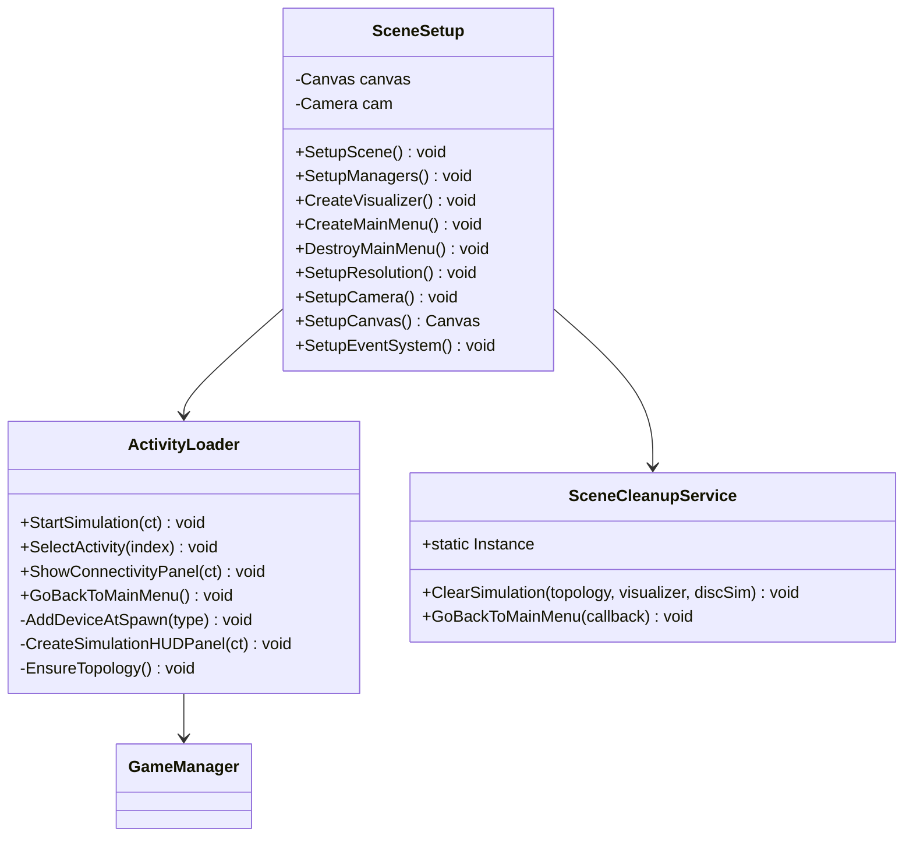
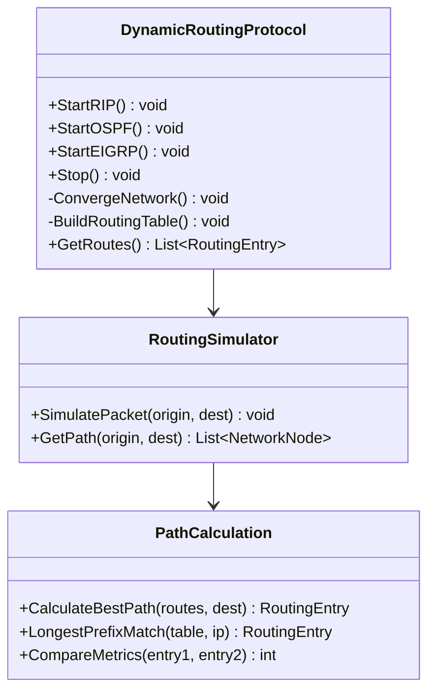
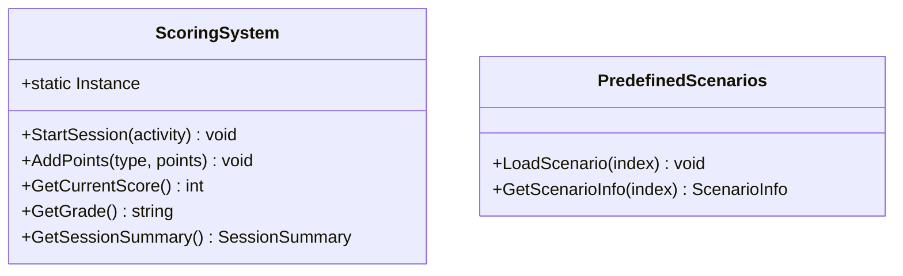

# DC-04: Diagrama de Clases — Simulation Layer

> **Propósito**: Mostrar el orquestador de escena, el cargador de actividades, las actividades académicas, el sistema de puntajes y el protocolo de enrutamiento dinámico.
> Dividido en 4 sub-diagramas: Núcleo de Simulación, Actividades, Protocolo Dinámico, y Puntajes/Escenarios.

---

## DC-04a: Núcleo de Simulación (SceneSetup, Loader, Cleanup)

---

## DC-04b: Actividades Académicas (7 actividades)

```mermaid
classDiagram
    class SimulationControls {
        +RemoveSelectedNodePublic() void
    }

    class BuildTopologyActivity {
        +DetectTopologyType() void
        +UpdateUI() void
    }

    class FindFaultActivity {
        +LoadScenario(index) void
        +CheckSolution() void
        +OnDiscButtonClicked() void
    }

    class RoutingTablesActivity {
        +RefreshTableUI() void
    }

    class BestRouteActivity {
        +LoadScenario(scenarioData) void
        +SelectBestRoute() void
    }

    class StaticRoutingActivity {
        +AddStaticRoute() void
        +TestRouting() void
    }

    class DynamicRoutingActivity {
        +StartProtocol(panel) void
        +StopProtocol(panel) void
        +ClearAllRoutes(panel) void
        +SetNeighborRouter(neighbor) void
    }

    class PredefinedScenarios {
        +LoadScenario(index) void
        +BuildScenarioTopology(index) void
        +GetCurrentScenario() ScenarioData
    }

    ActivityLoader --> BuildTopologyActivity
    ActivityLoader --> FindFaultActivity
    ActivityLoader --> RoutingTablesActivity
    ActivityLoader --> BestRouteActivity
    ActivityLoader --> StaticRoutingActivity
    ActivityLoader --> DynamicRoutingActivity
    ActivityLoader --> PredefinedScenarios
    ActivityLoader --> SimulationControls
```

---

## DC-04c: Protocolo de Enrutamiento Dinámico

---

## DC-04d: Sistema de Puntajes

---

## Archivos Relacionados

- `Assets/Scripts/Simulation/SceneSetup.cs` — Orquestador
- `Assets/Scripts/Simulation/ActivityLoader.cs` — Carga de actividades
- `Assets/Scripts/Simulation/SceneCleanupService.cs` — Limpieza de escena
- `Assets/Scripts/Simulation/BuildTopologyActivity.cs` — Actividad 0
- `Assets/Scripts/Simulation/FindFaultActivity.cs` — Actividad 1
- `Assets/Scripts/Simulation/RoutingTablesActivity.cs` — Actividad 2
- `Assets/Scripts/Simulation/BestRouteActivity.cs` — Actividad 3
- `Assets/Scripts/Simulation/StaticRoutingActivity.cs` — Actividad 4
- `Assets/Scripts/Simulation/DynamicRoutingActivity.cs` — Actividad 5
- `Assets/Scripts/Simulation/DynamicRoutingProtocol.cs` — Protocolo dinámico
- `Assets/Scripts/Simulation/PredefinedScenarios.cs` — Escenarios
- `Assets/Scripts/Simulation/ScoringSystem.cs` — Sistema de puntajes
- `Assets/Scripts/Simulation/SimulationControls.cs` — Controles de simulación
- `Assets/Scripts/Simulation/RoutingSimulator.cs` — Simulador de enrutamiento
- `Assets/Scripts/Simulation/PathCalculation.cs` — Cálculo de rutas
