# DC-05: Diagrama de Clases — UI Layer

> **Propósito**: Mostrar la estructura de la capa de presentación: visualización de nodos, animación de ping, creación de paneles, controladores de interacción y navegación.

```mermaid
classDiagram
    class UIPanelFactory {
        +static CreateMainMenu(parent) GameObject
        +static CreateActivitiesPanel(parent) GameObject
        +static CreateInstructionsPanel(parent) GameObject
        +static CreateConnectivityPanel(parent) ConnectivityPanelRefs
        +static CreateScorePanel(parent) GameObject
        +static CreateDevicesPanel(parent) GameObject
        +static CreateBuildTopologyInfoPanel(parent) GameObject
        +static CreateFindFaultPanel(parent) GameObject
        +static CreateBestRoutePanel(parent) GameObject
        +static CreateRoutingTablesPanel(parent) GameObject
        +static CreateStaticRoutingPanel(parent) GameObject
        +static CreateDynamicRoutingPanel(parent) GameObject
        +static CreateScenariosPanel(parent) GameObject
        +static CreateScenarioInfoPanel(parent) GameObject
        +static CreateIPConfigPanel(parent, node) GameObject
        +static CreateARPPanel(parent, node) GameObject
        +static CreateRoutingPanel(parent, node) GameObject
        +static CreateVLANPanel(parent) GameObject
        +static CreateACLPanel(parent) GameObject
        +static CreateNATPanel(parent) GameObject
    }

    class UIComponents {
        +static CreateRoundedPanel(parent, w, h, color) RectTransform
        +static CreateMenuButton(parent, text, w, h) GameObject
        +static CreateRoundedRectTexture(w, h, color) Texture2D
        +static CreateDeviceIcon(parent, type, size) GameObject
        +static class Colors
            +static Color backgroundBase
            +static Color surfacePanel
            +static Color surfaceElevated
            +static Color borderAccent
            +static Color textPrimary
            +static Color textSecondary
            +static Color buttonNormal
            +static Color buttonHover
    }

    class NodeVisualizer {
        -Dictionary~int, GameObject~ nodeObjects
        -Dictionary~int, GameObject~ linkObjects
        +CreateNodeVisual(node) void
        +DrawLinks() void
        +HighlightSelectedNode(discId) void
        +UpdateNodeLabel(discId) void
        +SelectNodeByDiscId(discId) void
        +CleanupNullReferences() void
    }

    class PingVisualizer {
        +static PingVisualizer Instance
        +AnimatePing(srcDiscId, dstDiscId, onComplete) void
        +BuildConnectivityFailReason(src, dst) string
    }

    class TopologyVisualizer {
        +CreateLinkVisual(link) void
        +UpdateLinkVisual(link) void
        +RemoveLinkVisual(link) void
    }

    class LinkModeController {
        +ToggleLinkMode(mode) void
        +HandleNodeLinkClick(discId) void
        +IsLinkModeActive() bool
    }

    class PingModeController {
        +TogglePingMode() void
        +HandlePingNodeClick(node) void
        +IsPingModeActive() bool
    }

    class IPConfigController {
        +ShowIPConfigPanel(node, discId) void
        +CloseIPConfigPanelPublic() void
        +IsIPConfigPanelOpen() bool
        +ShowARPPanel() void
        +ShowRoutingPanel() void
    }

    class DevicePanelController {
        +OnDeviceItemClicked(index) void
        +RemoveSelectedNode() void
        +RefreshDevicesPanel() void
        +UpdateScoreDisplay() void
    }

    class NodeInteractionController {
        +HandleNodeClick(discId) void
    }

    class MenuNavigator {
        +static MenuNavigator Instance
        +SetupPanel(panel, onEscape) void
        +ClearPanel() void
    }

    class MainMenuManager {
        +static MainMenuManager Instance
        +ShowMainMenu() void
    }

    class ConnectivityTestPanel {
        +ExecutePing() void
        +UpdatePanel() void
    }

    class IDEUMConfigurator {
        +ConfigureScreen() void
    }

    NodeInteractionController --> LinkModeController : delegar si activo
    NodeInteractionController --> PingModeController : delegar si activo
    NodeInteractionController --> IPConfigController : delegar si default
    DevicePanelController --> PingVisualizer : update score
    NodeVisualizer --> UIComponents : crear visuales
    UIPanelFactory --> UIComponents : crear paneles
```

## Posicionamiento de Paneles

| Panel | Posición | Anchor |
|-------|----------|--------|
| TopologyInfoPanel | Esquina superior derecha | (1,1) |
| DevicesPanel | Esquina superior izquierda | (0,1) |
| ScorePanel | Esquina inferior derecha | (1,0) |
| ScenariosPanel | Centro | (0.5,0.5) |
| VLAN/ACL/NAT Panels | Centro, auto-close | (0.5,0.5) |

## Archivos Relacionados

| Archivo | Namespace |
|---------|-----------|
| `Assets/Scripts/UI/UIPanelFactory.cs` | `SimRedes.UI` |
| `Assets/Scripts/UI/UIComponents.cs` | `SimRedes.UI` |
| `Assets/Scripts/UI/NodeVisualizer.cs` | `SimRedes.UI` |
| `Assets/Scripts/UI/PingVisualizer.cs` | `SimRedes.UI` |
| `Assets/Scripts/UI/LinkModeController.cs` | `SimRedes.UI` |
| `Assets/Scripts/UI/PingModeController.cs` | `SimRedes.UI` |
| `Assets/Scripts/UI/IPConfigController.cs` | `SimRedes.UI` |
| `Assets/Scripts/UI/DevicePanelController.cs` | `SimRedes.UI` |
| `Assets/Scripts/UI/NodeInteractionController.cs` | `SimRedes.UI` |
| `Assets/Scripts/UI/MenuNavigator.cs` | `SimRedes.UI` |
| Todos en `Assets/Scripts/UI/` | `SimRedes.UI` |
