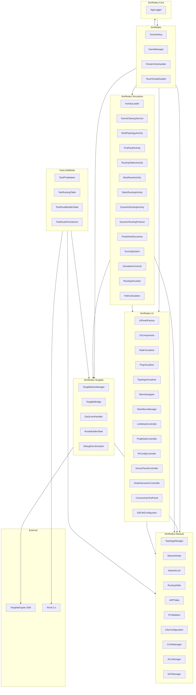

# DC-06: Diagrama de Paquetes (Namespaces)

> **Propósito**: Mostrar la organización del código en namespaces y sus dependencias.

## Resumen de Namespaces

| Namespace | Clases | Propósito |
|-----------|--------|-----------|
| `SimRedes` | 4 | Raíz: SceneSetup, GameManager, helpers |
| `SimRedes.Network` | 11 | Núcleo de networking: nodos, enlaces, tablas, IP |
| `SimRedes.Tangible` | 5 | Integración con hardware IDEUM |
| `SimRedes.Simulation` | 14 | Actividades, escenarios, puntajes, protocolos |
| `SimRedes.UI` | 14 | Paneles, visualización, controladores de interacción |
| `SimRedes.Core` | 1 | Utilidades transversales (AppLogger) |
| `Tests.EditMode.*` | 4 | Tests unitarios EditMode |

## Archivos Relacionados

- `Assets/Scripts/` — Código fuente principal
- `Assets/Editor/Tests/` — Tests unitarios EditMode
- `Assets/TangibleEngine/` — SDK externo de TangibleEngine
