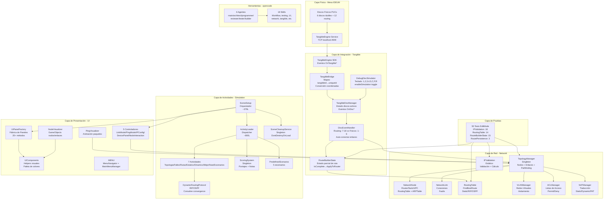

# DCMP-01: Diagrama de Componentes

> **Propósito**: Mostrar la arquitectura del sistema en capas, sus componentes y las dependencias entre ellos.

## Capas del Sistema

| Capa | Tecnología | Responsabilidad |
|------|-----------|-----------------|
| **Física** | Mesa IDEUM 55" + PUCs | Input táctil, discos físicos |
| **Integración** | TangibleEngine SDK (C#) | Traducir eventos físicos a eventos de software |
| **Red** | C# plain classes + MonoBehaviour | Simulación de red: nodos, enlaces, routing |
| **Actividades** | MonoBehaviour | 7 actividades académicas + sistema de evaluación |
| **Presentación** | Unity Canvas + uGUI | Interfaz de usuario, visualización, animación |
| **Pruebas** | NUnit 3.x (EditMode) | 50 tests unitarios |
| **Herramientas** | opencode + skills | Automatización de desarrollo con agentes IA |

## Singleton Patterns

| Componente | Patrón | Persistencia |
|-----------|--------|-------------|
| `SceneCleanupService` | Singleton | `DontDestroyOnLoad` |
| `TopologyManager` | Singleton | Destruido al salir |
| `TangibleDiscManager` | Singleton | Destruido al salir |
| `PingVisualizer` | Singleton | Destruido al salir |
| `ScoringSystem` | Singleton | Destruido al salir |
| `MenuNavigator` | Singleton | Destruido al salir |
