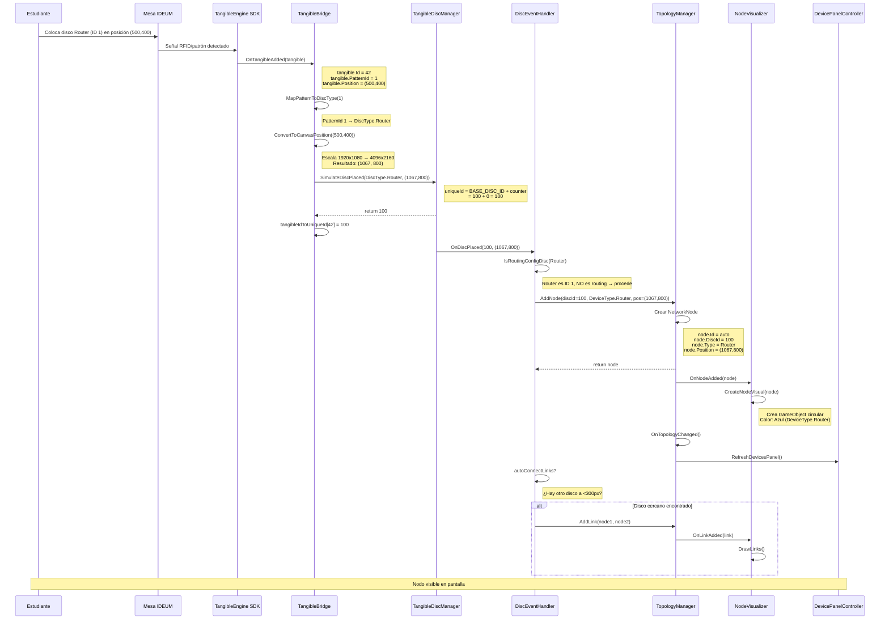
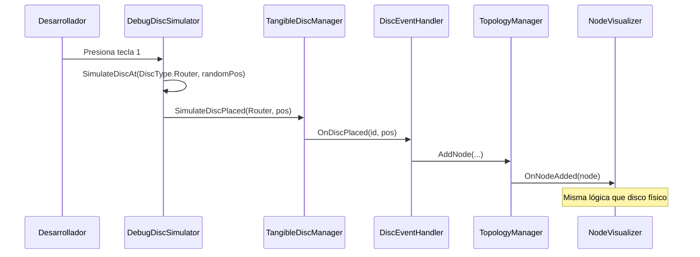

# DS-01: Secuencia — Colocar Disco Físico

> **Propósito**: Mostrar el flujo completo desde que un estudiante coloca un disco físico en la mesa IDEUM hasta que el nodo aparece visualizado en pantalla.

## Variante: Debug sin Discos Físicos

## Archivos Relacionados

| Archivo | Rol en el flujo |
|---------|----------------|
| `Assets/Scripts/Tangible/TangibleBridge.cs` | Puente TE → DiscManager |
| `Assets/Scripts/Tangible/TangibleDiscManager.cs` | IDs únicos, estado de discos |
| `Assets/Scripts/Tangible/DiscEventHandler.cs` | Enrutar disco a nodo o routing |
| `Assets/Scripts/Tangible/DebugDiscSimulator.cs` | Simulación por teclado |
| `Assets/Scripts/Network/TopologyManager.cs` | Crear nodo en topología |
| `Assets/Scripts/UI/NodeVisualizer.cs` | Visualizar nodo en canvas |
