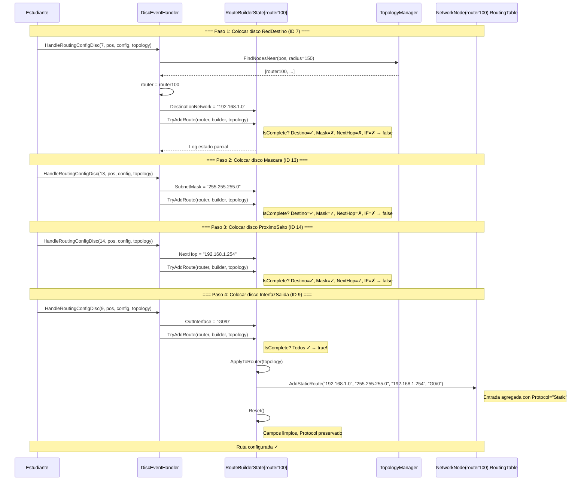
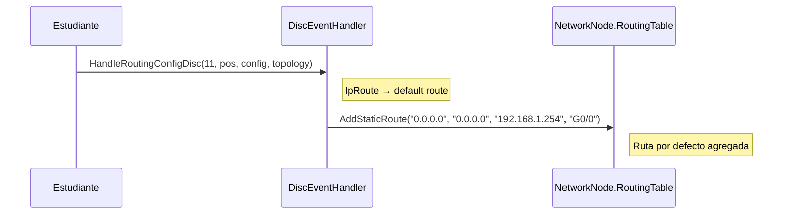

# DS-02: Secuencia — Configurar Ruta con Discos 7-18

> **Propósito**: Mostrar cómo un estudiante configura una ruta estática en un router colocando discos de routing (IDs 7-18) que construyen un RouteBuilderState parcial hasta completar los 4 campos necesarios.

## Variante: Disco IpRoute (ID 11) — Ruta por Defecto

## Estados de RouteBuilderState

| Estado | DestNetwork | SubnetMask | NextHop | OutInterface | IsComplete |
|--------|:-----------:|:----------:|:-------:|:------------:|:----------:|
| Vacío | ✗ | ✗ | ✗ | ✗ | false |
| RedDestino puesto | ✓ | ✗ | ✗ | ✗ | false |
| + Mascara | ✓ | ✓ | ✗ | ✗ | false |
| + ProximoSalto | ✓ | ✓ | ✓ | ✗ | false |
| + InterfazSalida | Si | Si | Si | Si | **true** |
| Tras ApplyToRouter | Limpio | Limpio | Limpio | Limpio | false |

## Archivos Relacionados

| Archivo | Rol |
|---------|-----|
| `Assets/Scripts/Tangible/DiscEventHandler.cs` | `HandleRoutingConfigDisc()` + `TryAddRoute()` |
| `Assets/Scripts/Tangible/RouteBuilderState.cs` | Estado transitorio de 4 campos + protocolo |
| `Assets/Scripts/Network/TopologyManager.cs` | `FindNodesNear()` para detectar router cercano |
| `Assets/Scripts/Network/RoutingTable.cs` | `AddStaticRoute()` destino final |
