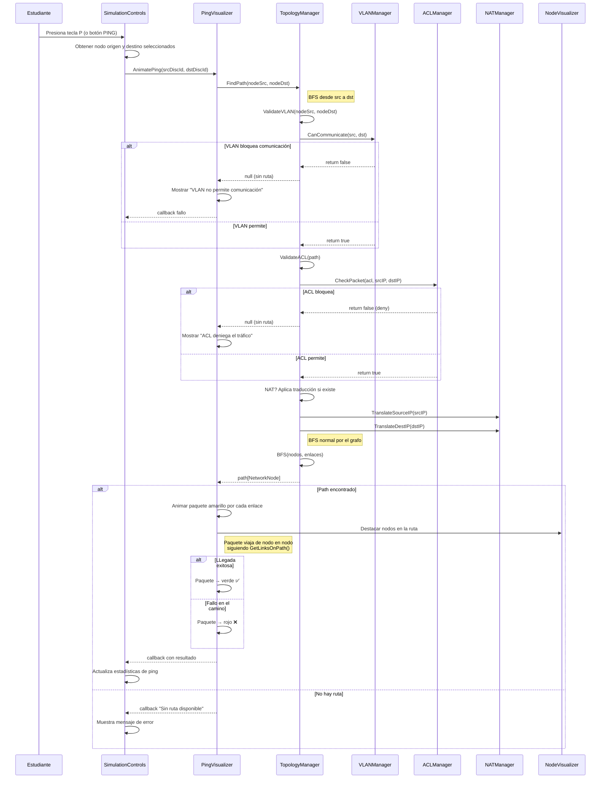

# DS-03: Secuencia — CheckConnectivity

> **Propósito**: Mostrar el flujo completo de validación de conectividad entre dos nodos, incluyendo pathfinding BFS, validación VLAN, ACL, NAT y animación de ping.



## Lógica de Pathfinding

```
CheckConnectivity(src, dst):
  1. Switch es L2 transparente (no requiere IP)
  2. Extremos no-Switch requieren IP + máscara válidas
  3. VLAN: CanCommunicate(src, dst)
  4. ACL: CheckPacket() en cada ACL aplicable
  5. NAT: TranslateSourceIP() + TranslateDestIP()
  6. BFS por TopologyManager.FindPath()
  7. Retorna true si hay ruta física + validaciones
```

## Archivos Relacionados

| Archivo | Rol |
|---------|-----|
| `Assets/Scripts/Network/TopologyManager.cs` | `FindPath()`, `CheckConnectivity()` |
| `Assets/Scripts/Network/VLANManager.cs` | `CanCommunicate()` |
| `Assets/Scripts/Network/ACLManager.cs` | `CheckPacket()` |
| `Assets/Scripts/Network/NATManager.cs` | `TranslateSourceIP()`, `TranslateDestIP()` |
| `Assets/Scripts/UI/PingVisualizer.cs` | `AnimatePing()` |
| `Assets/Scripts/UI/NodeVisualizer.cs` | Destacar nodos en ruta |
