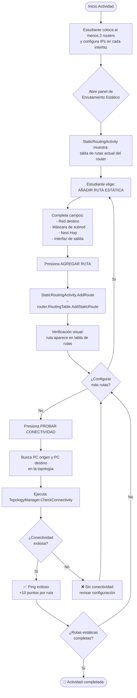

# DA-04: Diagrama de Actividad — Enrutamiento Estático

> **Propósito**: Mostrar el flujo de la Actividad 4 donde el estudiante configura rutas estáticas manualmente en los routers.



## Flujo Alternativo: Discos de Routing (IDs 7-14)

Los discos de routing pueden usarse en lugar del panel táctil:

```
1. Colocar disco RedDestino (ID 7) sobre un router
2. Colocar disco Mascara (ID 13) sobre el mismo router
3. Colocar disco ProximoSalto (ID 14) sobre el mismo router
4. Colocar disco InterfazSalida (ID 9) sobre el mismo router
→ Ruta completa automáticamente (RouteBuilderState.IsComplete → ApplyToRouter)
```

## Archivos Relacionados

- `Assets/Scripts/Simulation/StaticRoutingActivity.cs` — UI y lógica de rutas estáticas
- `Assets/Scripts/Network/RoutingTable.cs` — `AddStaticRoute()` con campos completos
- `Assets/Scripts/Tangible/RouteBuilderState.cs` — Construcción de ruta con discos
- `Assets/Scripts/Tangible/DiscEventHandler.cs` — `HandleRoutingConfigDisc()`
