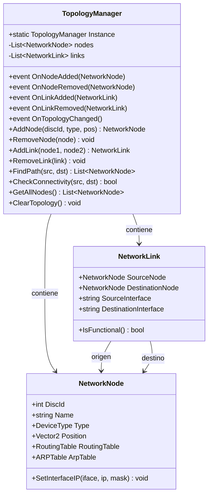
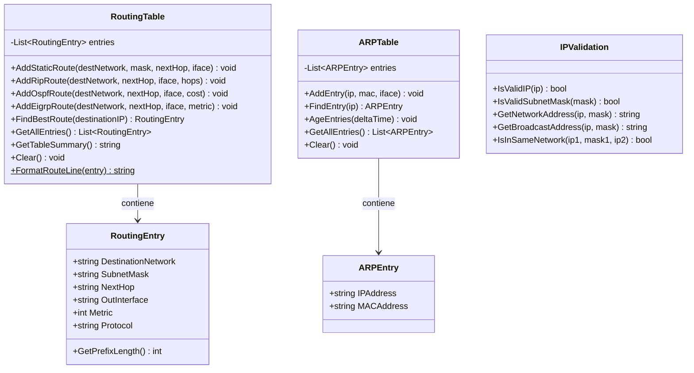
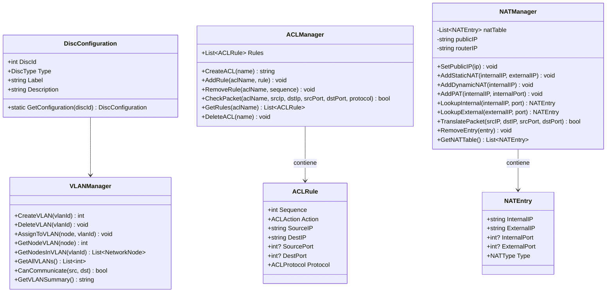

# DC-02: Diagrama de Clases — Network Layer

> **Propósito**: Mostrar la estructura del núcleo de networking del simulador.
> Dividido en 3 sub-diagramas: Núcleo de Red, Tablas de Enrutamiento/ARP, y Gestión Avanzada.

---

## DC-02a: Núcleo de Red (TopologyManager, Nodos, Enlaces)

---

## DC-02b: Tablas de Enrutamiento, ARP y Validación IP

---

## DC-02c: Gestión Avanzada (VLAN, ACL, NAT)

---

## Archivos Relacionados

- `Assets/Scripts/Network/TopologyManager.cs` — Gestor de topología
- `Assets/Scripts/Network/NetworkNode.cs` — Nodo de red
- `Assets/Scripts/Network/NetworkLink.cs` — Enlace entre nodos
- `Assets/Scripts/Network/RoutingTable.cs` — Tabla de enrutamiento
- `Assets/Scripts/Network/ARPTable.cs` — Tabla ARP
- `Assets/Scripts/Network/IPValidation.cs` — Validación de direcciones IP
- `Assets/Scripts/Network/DiscConfiguration.cs` — Configuración de discos virtuales
- `Assets/Scripts/Network/VLANManager.cs` — Gestión de VLANs
- `Assets/Scripts/Network/ACLManager.cs` — Gestión de ACLs
- `Assets/Scripts/Network/NATManager.cs` — Gestión de NAT
