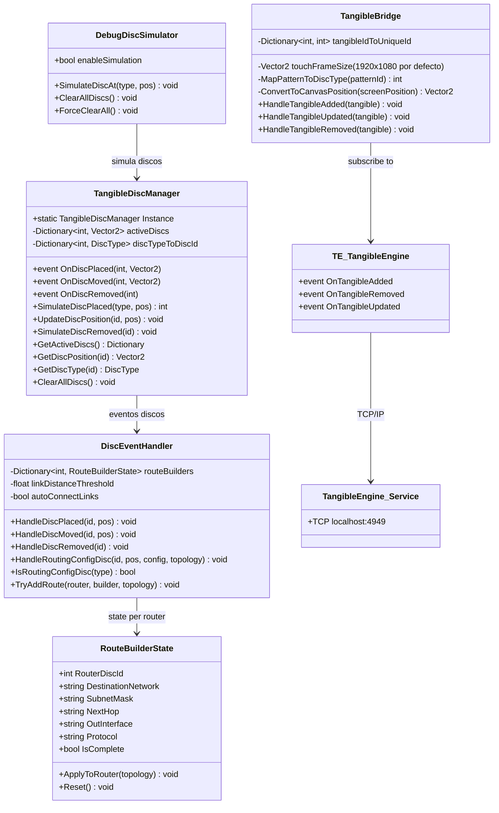

# DC-03: Diagrama de Clases — Tangible Layer

> **Propósito**: Mostrar la integración con el hardware IDEUM: detección de discos físicos, mapeo de coordenadas, y configuración de rutas mediante discos de routing (IDs 7-18).



## Flujo de Datos

```
Mesa IDEUM → TE Service → TangibleEngine → TangibleBridge → TangibleDiscManager → DiscEventHandler → TopologyManager
```

## Discos (IDs 1-6): físicos 1-3 + virtuales 4-6

> TangibleEngine solo acepta patrones **1-3** (discos físicos); los IDs 4-6 son discos
> virtuales generados por `DebugDiscSimulator`/actividades.

| ID | Tipo | Color | Creación |
|:--:|------|-------|----------|
| 1 | Router | Azul | Crea nodo en TopologyManager |
| 2 | Switch | Cyan | Crea nodo en TopologyManager |
| 3 | PC | Verde | Crea nodo en TopologyManager |
| 4 | Enlace | Amarillo | Activa modo CONEXIÓN |
| 5 | Fallo | Rojo | Simula error en topología |
| 6 | Protocolo | Magenta | (reservado) |

## Discos de Configuración de Routing (IDs 7-18)

| ID | Tipo | Efecto sobre RouteBuilderState |
|:--:|------|-------------------------------|
| 7 | RedDestino | `builder.DestinationNetwork = "192.168.1.0"` |
| 8 | Métrica | Métrica = 10 en última ruta del router |
| 9 | InterfazSalida | `builder.OutInterface = "G0/0"-"G0/3"` |
| 10 | ModoEnrutamiento | Toggle Static ↔ RIP ↔ OSPF ↔ EIGRP |
| 11 | IpRoute | `AddStaticRoute(0.0.0.0/0 → 192.168.1.254)` |
| 12 | Destino | Mismo que RedDestino |
| 13 | Mascara | `builder.SubnetMask = "255.255.255.0"` |
| 14 | ProximoSalto | `builder.NextHop = "192.168.1.254"` |
| 15-18 | Vecino/Costo/BW/AnunciarRed | Logging "soporte próximamente" |

## Archivos Relacionados

| Archivo | Namespace |
|---------|-----------|
| `Assets/Scripts/Tangible/TangibleDiscManager.cs` | `SimRedes.Tangible` |
| `Assets/Scripts/Tangible/TangibleBridge.cs` | `SimRedes.Tangible` |
| `Assets/Scripts/Tangible/DiscEventHandler.cs` | `SimRedes.Tangible` |
| `Assets/Scripts/Tangible/RouteBuilderState.cs` | `SimRedes.Tangible` |
| `Assets/Scripts/Tangible/DebugDiscSimulator.cs` | `SimRedes.Tangible` |
