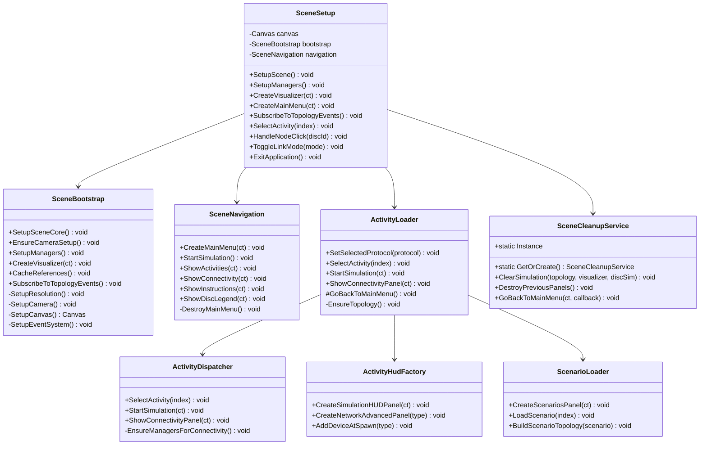
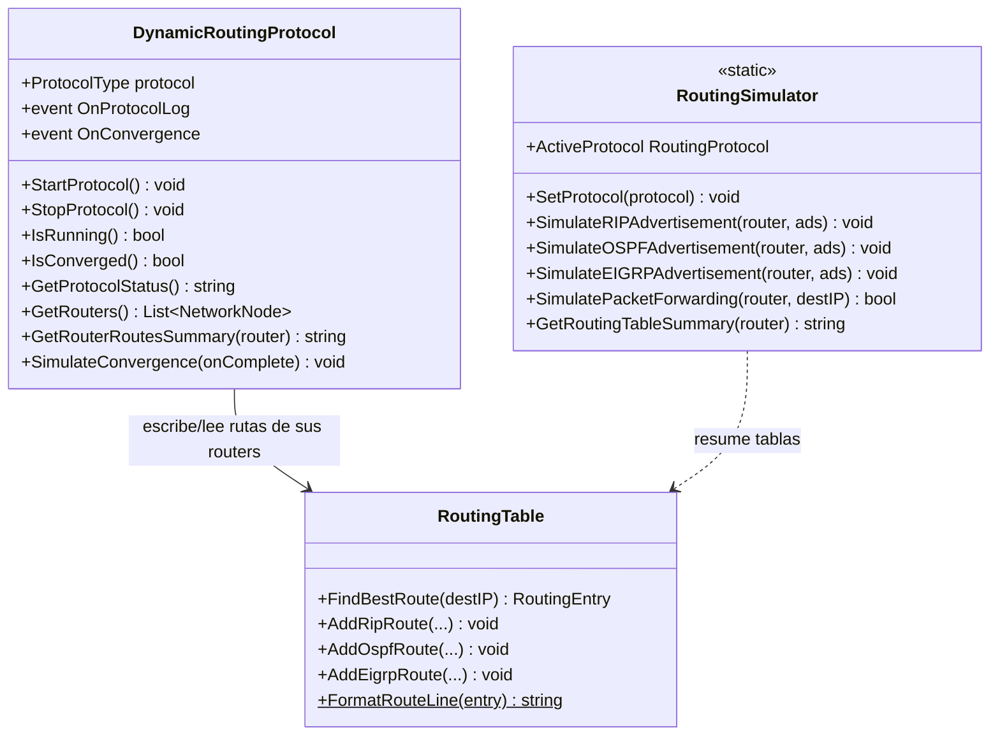
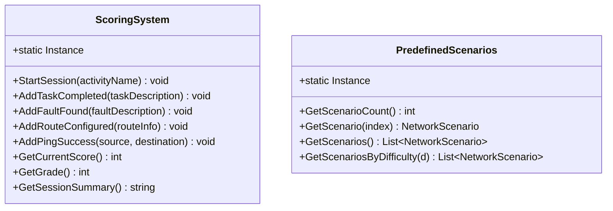

# DC-04: Diagrama de Clases — Simulation Layer

> **Propósito**: Mostrar el orquestador de escena, el cargador de actividades, las actividades académicas, el sistema de puntajes y el protocolo de enrutamiento dinámico.
> Dividido en 4 sub-diagramas: Núcleo de Simulación, Actividades, Protocolo Dinámico, y Puntajes/Escenarios.

---

## DC-04a: Núcleo de Simulación (fachadas SceneSetup/ActivityLoader + componentes C5)

---

## DC-04b: Actividades Académicas (7 actividades)

```mermaid
classDiagram
    class SimulationControls {
        +static ShouldRemoveSelectedNodeOnR() bool
        +static ShouldSkipMainMenuSweep(canvas, sceneSetup) bool
        +GoBackToMainMenu() void
    }

    class BuildTopologyActivity {
        -DetectTopologyType() void
        -UpdateUI() void
        +GetCurrentTopology() TopologyType
    }

    class FindFaultActivity {
        +LoadScenario(index) void
        -ValidateSolution(scenario) bool
        +OnDiscButtonClicked() void
    }

    class RoutingTablesActivity {
        +RefreshRoutingTables() void
        +bool IsRefreshPanelVisible
    }

    class BestRouteActivity {
        -ShowScenario(index) void
        -OnRouteSelected(optionIndex) void
        +NextScenario() void
    }

    class StaticRoutingActivity {
        +AddRoute(destNetwork, mask, nextHop, outInterface) void
        +TestRouting() void
    }

    class DynamicRoutingActivity {
        +StartProtocol(panel) void
        +StopProtocol(panel) void
        +ClearAllRoutes(panel) void
        +SetNeighborRouter(neighbor) void
    }

    class PredefinedScenarios {
        +GetScenario(index) NetworkScenario
        +GetScenarioCount() int
    }

    class ActivityDispatcher {
        +SelectActivity(index) void
        +StartSimulation(ct) void
        +ShowConnectivityPanel(ct) void
    }

    class ScenarioLoader {
        +LoadScenario(index) void
        +BuildScenarioTopology(scenario) void
    }

    ActivityDispatcher --> BuildTopologyActivity
    ActivityDispatcher --> FindFaultActivity
    ActivityDispatcher --> RoutingTablesActivity
    ActivityDispatcher --> BestRouteActivity
    ActivityDispatcher --> StaticRoutingActivity
    ActivityDispatcher --> DynamicRoutingActivity
    ActivityDispatcher --> SimulationControls
    ScenarioLoader --> PredefinedScenarios
```

---

## DC-04c: Protocolo de Enrutamiento Dinámico

> Notas: la selección de protocolo (RIP/OSPF/EIGRP) vive en `protocol`,
> no en `StartRIP/StartOSPF/StartEIGRP` (no existen). El Longest Prefix Match
> está en `RoutingTable.FindBestRoute`, no en una clase `PathCalculation`
> (esa clase nunca existió en el código). `RoutingSimulator` es `static`
> y vive en `RoutingProtocols.cs`.

---

## DC-04d: Sistema de Puntajes

> Nota: los puntos se registran con los métodos `Add*` específicos
> (`AddTaskCompleted`, `AddFaultFound`, `AddRouteConfigured`, `AddPingSuccess`);
> no existe `AddPoints(type, points)`. La carga/aplicación de un escenario vive
> en `ScenarioLoader` (`LoadScenario`/`BuildScenarioTopology`), no en
> `PredefinedScenarios`, que solo es el catálogo.

---

## Archivos Relacionados

- `Assets/Scripts/Simulation/SceneSetup.cs` — Fachada de escena (delega en SceneBootstrap/SceneNavigation)
- `Assets/Scripts/Simulation/SceneBootstrap.cs` — Raíz de composición (canvas, managers, eventos)
- `Assets/Scripts/Simulation/SceneNavigation.cs` — Menú y paneles
- `Assets/Scripts/Simulation/ActivityLoader.cs` — Fachada de actividades
- `Assets/Scripts/Simulation/ActivityDispatcher.cs` — Despacho de actividades 0-6
- `Assets/Scripts/Simulation/ScenarioLoader.cs` — Carga y construcción de escenarios
- `Assets/Scripts/Simulation/SceneCleanupService.cs` — Limpieza de escena (ruta única)
- `Assets/Scripts/Simulation/BuildTopologyActivity.cs` — Actividad 0
- `Assets/Scripts/Simulation/FindFaultActivity.cs` — Actividad 1
- `Assets/Scripts/Simulation/RoutingTablesActivity.cs` — Actividad 2
- `Assets/Scripts/Simulation/BestRouteActivity.cs` — Actividad 3
- `Assets/Scripts/Simulation/StaticRoutingActivity.cs` — Actividad 4
- `Assets/Scripts/Simulation/DynamicRoutingActivity.cs` — Actividad 5
- `Assets/Scripts/Simulation/DynamicRoutingProtocol.cs` — Protocolo dinámico
- `Assets/Scripts/Simulation/PredefinedScenarios.cs` — Escenarios
- `Assets/Scripts/Simulation/ScoringSystem.cs` — Sistema de puntajes
- `Assets/Scripts/Simulation/SimulationControls.cs` — Controles de simulación
- `Assets/Scripts/Simulation/RoutingProtocols.cs` — `RoutingSimulator` (estático) + enum `RoutingProtocol`
