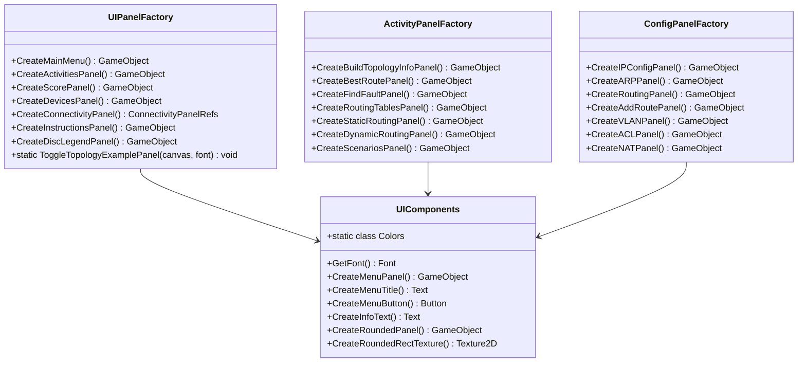
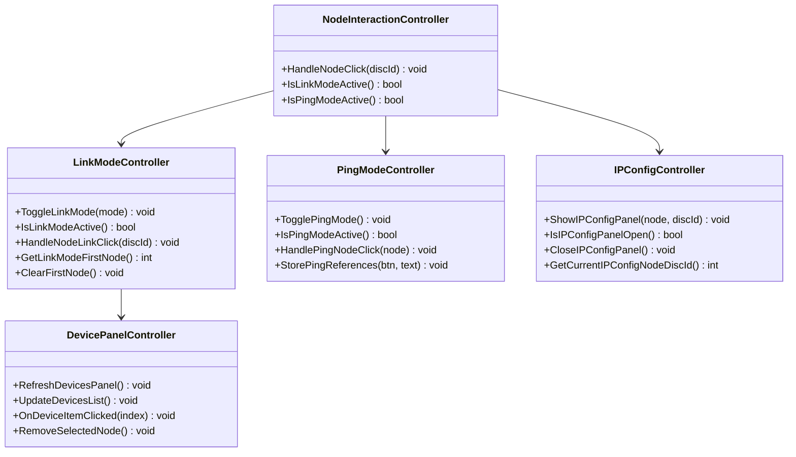
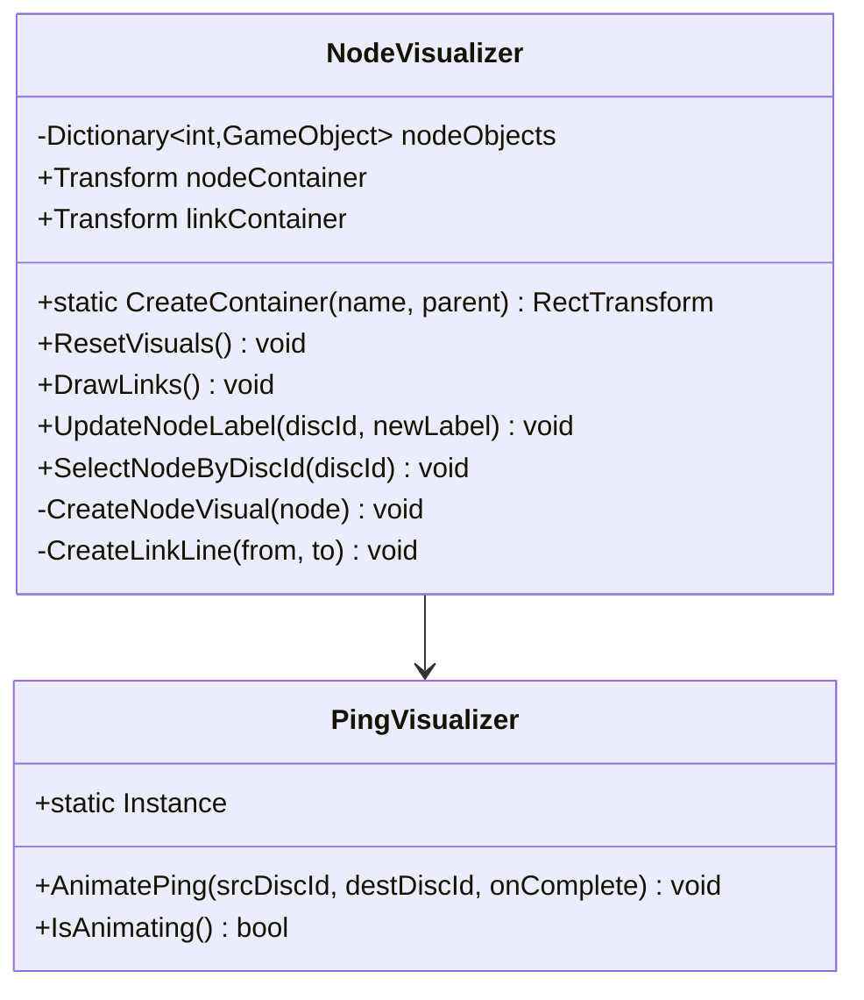
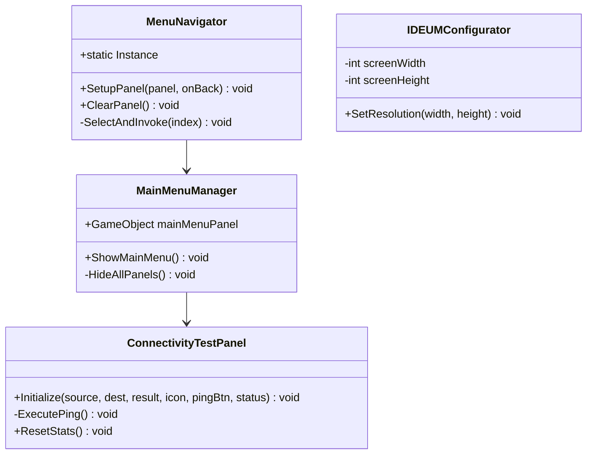

# DC-05: Diagrama de Clases — UI Layer

> **Propósito**: Mostrar la estructura de la capa de interfaz de usuario: factories, controladores, visualizadores y navegación.
> Dividido en 4 sub-diagramas: Factories, Controladores, Visualización, y Navegación/Utilidades.

---

## DC-05a: Factories UI

---

## DC-05b: Controladores de Interacción

---

## DC-05c: Visualización de Red

---

## DC-05d: Navegación y Utilidades

---

## Archivos Relacionados

- `Assets/Scripts/UI/UIPanelFactory.cs` — Factory de paneles de navegación/info
- `Assets/Scripts/UI/ActivityPanelFactory.cs` — Factory de paneles de actividades
- `Assets/Scripts/UI/ConfigPanelFactory.cs` — Factory de paneles de configuración
- `Assets/Scripts/UI/UIComponents.cs` — Componentes UI reutilizables
- `Assets/Scripts/UI/NodeVisualizer.cs` — Visualizador de nodos
- `Assets/Scripts/UI/PingVisualizer.cs` — Visualizador de pings
- `Assets/Scripts/UI/LinkModeController.cs` — Control de modo enlace
- `Assets/Scripts/UI/PingModeController.cs` — Control de modo ping
- `Assets/Scripts/UI/IPConfigController.cs` — Control de configuración IP
- `Assets/Scripts/UI/DevicePanelController.cs` — Panel de dispositivos
- `Assets/Scripts/UI/NodeInteractionController.cs` — Interacción con nodos
- `Assets/Scripts/UI/MenuNavigator.cs` — Navegación por menú
- `Assets/Scripts/UI/MainMenuManager.cs` — Gestor del menú principal
- `Assets/Scripts/UI/ConnectivityTestPanel.cs` — Panel de prueba de conectividad
- `Assets/Scripts/UI/IDEUMConfigurator.cs` — Configuración de pantalla IDEUM
