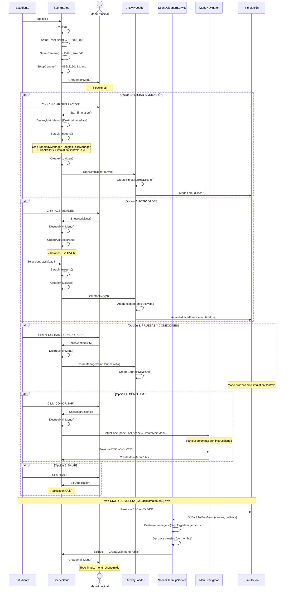

# DS-04: Secuencia — Navegación de Menús

> **Propósito**: Mostrar el flujo de navegación desde el menú principal hasta las actividades y el ciclo de vuelta (GoBackToMainMenu).



## Mapa de Navegación

```
                    ┌─────────────────────┐
                    │   MENÚ PRINCIPAL     │
                    │ 1. INICIAR SIMULACIÓN│
                    │ 2. ACTIVIDADES       │
                    │ 3. PRUEBAS Y CONEX.  │
                    │ 4. CÓMO USAR         │
                    │ 5. SALIR             │
                    └──────┬──────┬───────┘
                           │      │
          ┌────────────────┘      └────────────────┐
          ▼                                          ▼
  ┌──────────────┐                          ┌──────────────┐
  │ ACTIVIDADES   │                          │ SIMULACIÓN   │
  │ 0-6 botones   │                          │ Topología    │
  │ VOLVER → Menú │                          │ PING, VLAN   │
  └──────┬───────┘                          │ ESC → Menú   │
         │                                   └──────────────┘
         ▼
  ┌──────────────┐
  │ Actividad N   │
  │ Panel + lógica │
  │ ESC → Menú    │
  └──────────────┘
```

## Archivos Relacionados

| Archivo | Rol |
|---------|-----|
| `Assets/Scripts/Simulation/SceneSetup.cs` | Orquestador de navegación |
| `Assets/Scripts/Simulation/SceneCleanupService.cs` | Limpieza y retorno |
| `Assets/Scripts/Simulation/ActivityLoader.cs` | Carga de actividades |
| `Assets/Scripts/UI/MenuNavigator.cs` | Navegación por teclado |
| `Assets/Scripts/UI/UIPanelFactory.cs` | Creación de todos los paneles |
| `Assets/Scripts/Simulation/SimulationControls.cs` | ESC unificado |
