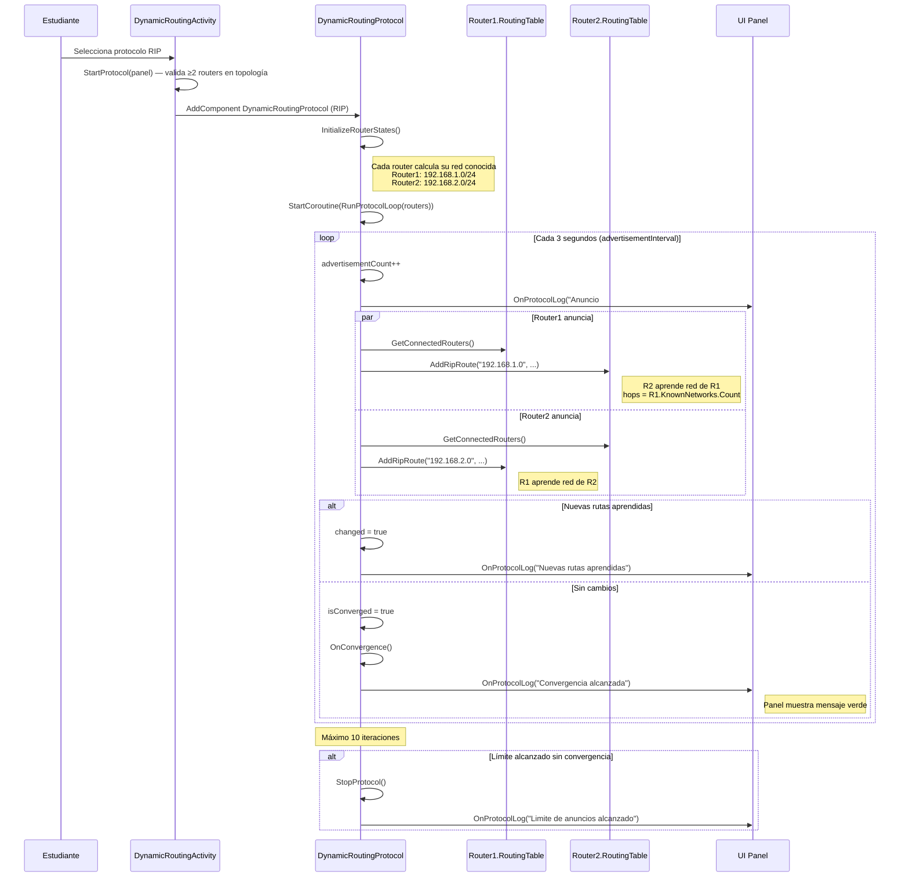
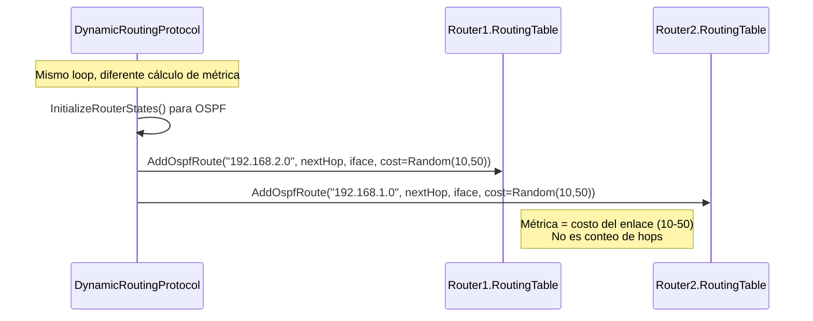

# DS-05: Secuencia — Enrutamiento Dinámico RIP/OSPF/EIGRP

> **Propósito**: Mostrar cómo funciona el protocolo de enrutamiento dinámico: inicio, anuncios periódicos, convergencia y visualización.



## Variante: OSPF



## Comparación RIP vs OSPF

| Característica | RIP | OSPF |
|---------------|:---:|:----:|
| Métrica | Conteo de hops | Costo por enlace (10-50) |
| Máxima métrica | 15 saltos | Ilimitado |
| Tipo | Distance Vector | Link State (simplificado) |
| Frecuencia anuncio | Cada 3s | Cada 3s |
| Método de anuncio | Vecinos reciben redes conocidas | Costo aleatorio por enlace |
| Convergencia | Cuando no hay nuevas rutas | Misma lógica |

## Estados de DynamicRoutingProtocol

```
IDLE → RUNNING → CONVERGED → (opcional) STOPPED
          ↑__________| (si no converge en 10 iteraciones)
```

## Archivos Relacionados

| Archivo | Rol |
|---------|-----|
| `Assets/Scripts/Simulation/DynamicRoutingProtocol.cs` | Motor de protocolo (coroutine) |
| `Assets/Scripts/Simulation/DynamicRoutingActivity.cs` | UI de la actividad |
| `Assets/Scripts/Simulation/DynamicRoutingActivity.cs` | `StartProtocol(panel)` / `StopProtocol(panel)` |
| `Assets/Scripts/Simulation/RoutingProtocols.cs` | `RoutingSimulator` estático |
| `Assets/Scripts/Network/RoutingTable.cs` | `AddRipRoute()` / `AddOspfRoute()` |
