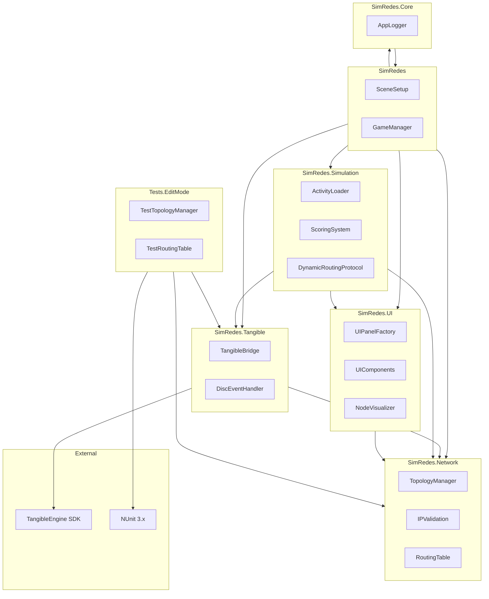

# DC-06a: Visión General de Namespaces

```mermaid
graph TB
    subgraph S1["SimRedes"]
        SceneSetup
        GameManager
    end

    subgraph S2["SimRedes.Network"]
        TopologyManager
        IPValidation
        RoutingTable
    end

    subgraph S3["SimRedes.Tangible"]
        TangibleBridge
        DiscEventHandler
    end

    subgraph S4["SimRedes.Simulation"]
        ActivityLoader
        ScoringSystem
        DynamicRoutingProtocol
    end

    subgraph S5["SimRedes.UI"]
        UIPanelFactory
        UIComponents
        NodeVisualizer
    end

    subgraph S6["SimRedes.Core"]
        AppLogger
    end

    subgraph S7["External"]
        TE["TangibleEngine SDK"]
        NUnit["NUnit 3.x"]
    end

    subgraph S8["Tests.EditMode"]
        TestTopologyManager
        TestRoutingTable
    end

    S1 --> S2
    S1 --> S5
    S1 --> S4
    S1 --> S3
    S1 --> S6

    S3 --> S2
    S3 --> TE

    S4 --> S2
    S4 --> S5
    S4 --> S3

    S5 --> S2

    S6 --> S1

    S8 --> S2
    S8 --> S3
    S8 --> NUnit
```
