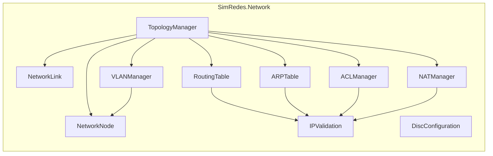

# DC-06b: SimRedes.Network

```mermaid
graph LR
    subgraph S2["SimRedes.Network"]
        TM[TopologyManager]
        NN[NetworkNode]
        NL[NetworkLink]
        RT[RoutingTable]
        ARP[ARPTable]
        IP[IPValidation]
        DC[DiscConfiguration]
        VLAN[VLANManager]
        ACL[ACLManager]
        NAT[NATManager]
    end

    TM --> NN
    TM --> NL
    TM --> RT
    TM --> ARP
    TM --> VLAN
    TM --> ACL
    TM --> NAT

    RT --> IP
    ARP --> IP
    VLAN --> NN
    ACL --> IP
    NAT --> IP
```
