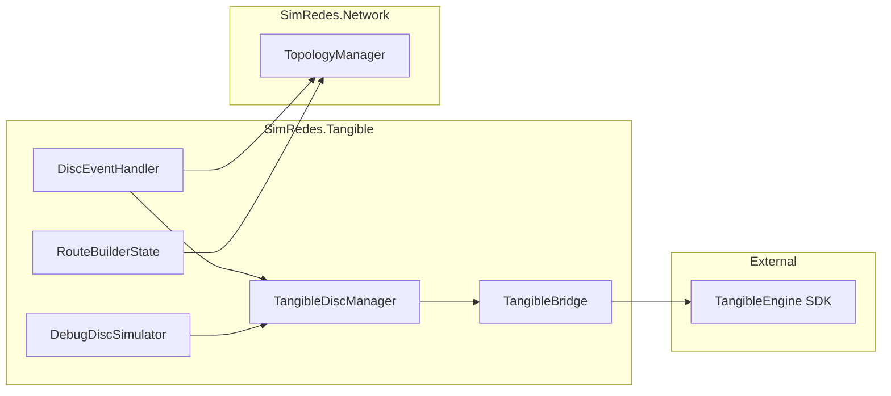

# DC-06c: SimRedes.Tangible

```mermaid
graph LR
    subgraph S3["SimRedes.Tangible"]
        TDM[TangibleDiscManager]
        TB[TangibleBridge]
        DEH[DiscEventHandler]
        RBS[RouteBuilderState]
        DDS[DebugDiscSimulator]
    end

    subgraph EXT["External"]
        TE["TangibleEngine SDK"]
    end

    subgraph NET["SimRedes.Network"]
        TM[TopologyManager]
    end

    TB --> TE
    TDM --> TB
    DEH --> TDM
    DEH --> TM
    RBS --> TM
    DDS --> TDM
```
