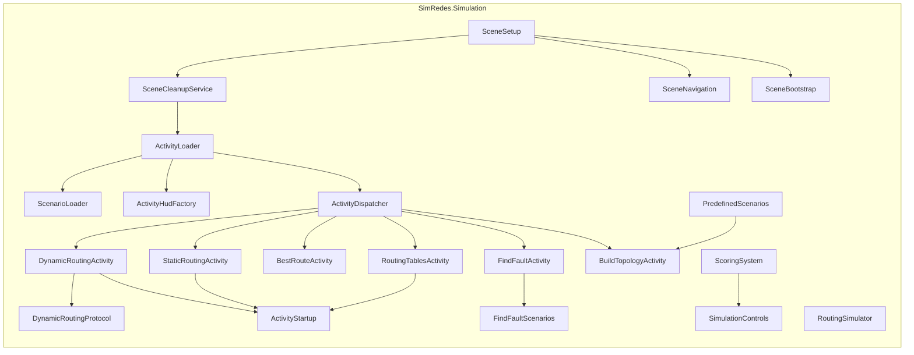

# DC-06d: SimRedes.Simulation

```mermaid
graph LR
    subgraph S4["SimRedes.Simulation"]
        AL[ActivityLoader]
        SCH[SceneSetup]
        AD[ActivityDispatcher]
        AHF[ActivityHudFactory]
        SL[ScenarioLoader]
        SB[SceneBootstrap]
        SN[SceneNavigation]
        AST[ActivityStartup]
        FFS[FindFaultScenarios]
        SCS[SceneCleanupService]
        BTA[BuildTopologyActivity]
        FFA[FindFaultActivity]
        RTA[RoutingTablesActivity]
        BRA[BestRouteActivity]
        SRA[StaticRoutingActivity]
        DRA[DynamicRoutingActivity]
        DRP[DynamicRoutingProtocol]
        PS[PredefinedScenarios]
        SS[ScoringSystem]
        SC[SimulationControls]
        RS[RoutingSimulator]
    end

    AL --> AD
    AL --> AHF
    AL --> SL
    SCH --> SB
    SCH --> SN
    SCH --> SCS
    RTA --> AST
    SRA --> AST
    DRA --> AST
    FFA --> FFS

    AD --> BTA
    AD --> FFA
    AD --> RTA
    AD --> BRA
    AD --> SRA
    AD --> DRA

    DRA --> DRP

    SS --> SC
    PS --> BTA
    SCS --> AL
```
