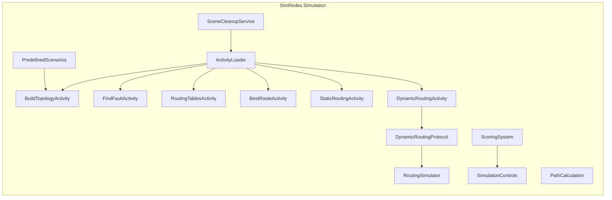

# DC-06d: SimRedes.Simulation

```mermaid
graph LR
    subgraph S4["SimRedes.Simulation"]
        AL[ActivityLoader]
        SCS[SceneCleanupService]
        BTA[BuildTopologyActivity]
        FFA[FindFaultActivity]
        RTA[RoutingTablesActivity]
        BRA[BestRouteActivity]
        SRA[StaticRoutingActivity]
        DRA[DynamicRoutingActivity]
        DRP[DynamicRoutingProtocol]
        PS[PredefinedScenarios]
        SS[ScoringSystem]
        SC[SimulationControls]
        RS[RoutingSimulator]
        PC[PathCalculation]
    end

    AL --> BTA
    AL --> FFA
    AL --> RTA
    AL --> BRA
    AL --> SRA
    AL --> DRA

    DRA --> DRP
    DRP --> RS

    SS --> SC
    PS --> BTA
    SCS --> AL
```
