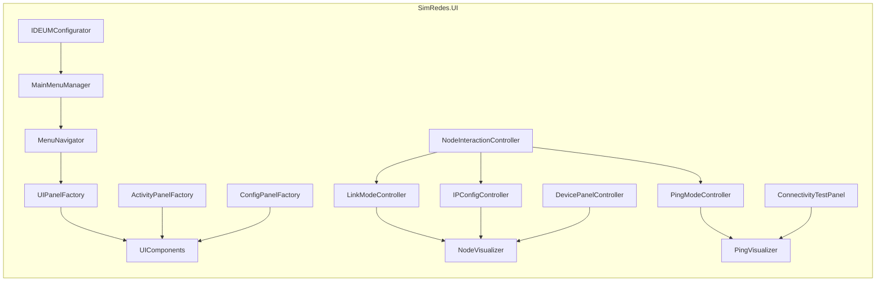

# DC-06e: SimRedes.UI

```mermaid
graph LR
    subgraph S5["SimRedes.UI"]
        UPF[UIPanelFactory]
        APF[ActivityPanelFactory]
        CPF[ConfigPanelFactory]
        UIC[UIComponents]
        NV[NodeVisualizer]
        PV[PingVisualizer]
        MN[MenuNavigator]
        MMM[MainMenuManager]
        LMC[LinkModeController]
        PMC[PingModeController]
        IPC[IPConfigController]
        DPC[DevicePanelController]
        NIC[NodeInteractionController]
        CTP[ConnectivityTestPanel]
        IDC[IDEUMConfigurator]
    end

    UPF --> UIC
    APF --> UIC
    CPF --> UIC

    MN --> UPF
    MMM --> MN

    LMC --> NV
    PMC --> PV
    IPC --> NV
    DPC --> NV
    NIC --> LMC
    NIC --> PMC
    NIC --> IPC

    CTP --> PV
    IDC --> MMM
```
