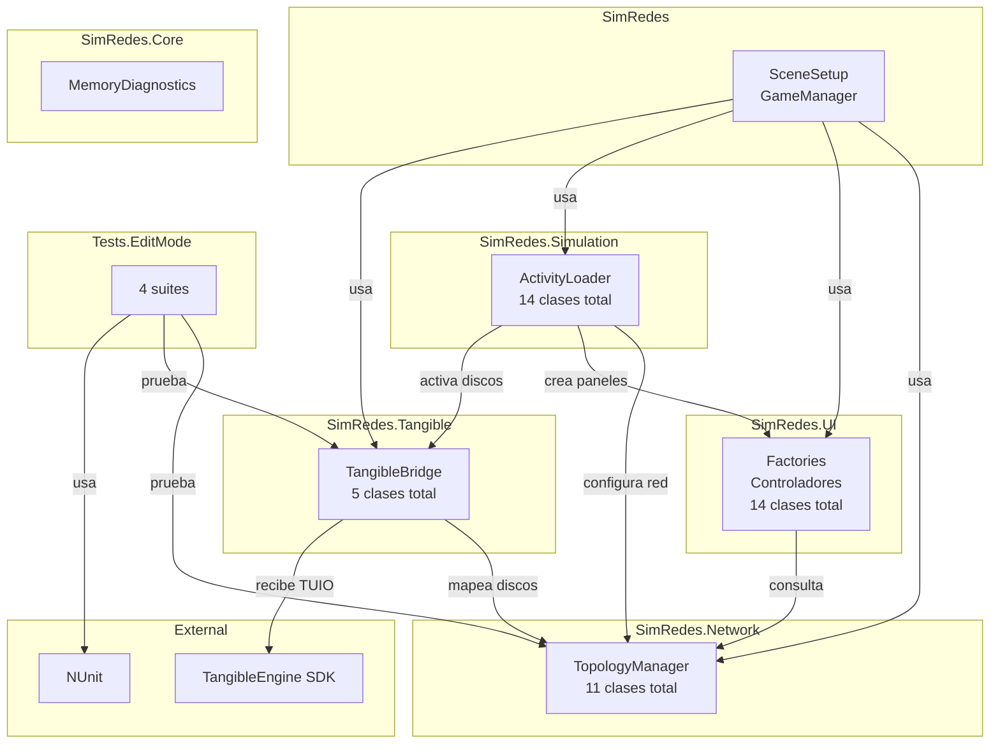

# DC-06f: Dependencias entre Namespaces

```mermaid
graph TB
    subgraph SIM["SimRedes"]
        ROOT[SceneSetup<br/>GameManager]
    end

    subgraph NET["SimRedes.Network"]
        TM[TopologyManager<br/>11 clases total]
    end

    subgraph TAN["SimRedes.Tangible"]
        TB[TangibleBridge<br/>5 clases total]
    end

    subgraph ACT["SimRedes.Simulation"]
        AL[ActivityLoader<br/>14 clases total]
    end

    subgraph UI["SimRedes.UI"]
        FAC[Factories<br/>Controladores<br/>14 clases total]
    end

    subgraph CORE["SimRedes.Core"]
        MD[MemoryDiagnostics]
    end

    subgraph EXT["External"]
        TE[TangibleEngine SDK]
        NU[NUnit]
    end

    subgraph TEST["Tests.EditMode"]
        TST[4 suites]
    end

    ROOT -->|usa| TM
    ROOT -->|usa| FAC
    ROOT -->|usa| AL
    ROOT -->|usa| TB

    TB -->|mapea discos| TM
    TB -->|recibe TUIO| TE

    AL -->|configura red| TM
    AL -->|crea paneles| FAC
    AL -->|activa discos| TB

    FAC -->|consulta| TM

    TST -->|prueba| TM
    TST -->|prueba| TB
    TST -->|usa| NU
```
