# 01 — Grafo de Dependencias (Imports Reales)

> **Propósito**: Mostrar qué archivos dependen de qué otros archivos basándose en los imports reales del código (`using SimRedes.*`).
> Solo se muestran dependencias internas del proyecto (no UnityEngine, System, etc.).

---

## Grafo Visual por Namespace

```mermaid
graph TB
    subgraph "Network"
        IPV[IPValidation]
        DC[DiscConfiguration]
        ACL[ACLManager]
        NAT[NATManager]
        ARP[ARPTable]
        NL[NetworkLink]
        RT[RoutingTable]
        VLAN[VLANManager]
        NN[NetworkNode]
        TM[TopologyManager]
    end

    subgraph "Tangible"
        TDM[TangibleDiscManager]
        TB[TangibleBridge]
        RBS[RouteBuilderState]
        DEH[DiscEventHandler]
        DDS[DebugDiscSimulator]
    end

    subgraph "Simulation"
        MD[MemoryDiagnostics]
        PC[PointerClickHandler]
        TS[TouchScriptDisabler]
        PRED[PredefinedScenarios]
        SC[ScoringSystem]
        RP[RoutingProtocols]
        BTA[BuildTopologyActivity]
        RTA[RoutingTablesActivity]
        BRA[BestRouteActivity]
        SRA[StaticRoutingActivity]
        DRA[DynamicRoutingActivity]
        DRP[DynamicRoutingProtocol]
        FFA[FindFaultActivity]
        SIMC[SimulationControls]
        SCS[SceneCleanupService]
        AL[ActivityLoader]
        AD[ActivityDispatcher]
        AHF[ActivityHudFactory]
        SL[ScenarioLoader]
        SS[SceneSetup]
        SB[SceneBootstrap]
        SN[SceneNavigation]
        AST[ActivityStartup]
        FFS[FindFaultScenarios]
    end

    subgraph "UI"
        ICFG[IDEUMConfigurator]
        UIC[UIComponents]
        MN[MenuNavigator]
        MMM[MainMenuManager]
        NV[NodeVisualizer]
        PV[PingVisualizer]
        CTP[ConnectivityTestPanel]
        LM[LinkModeController]
        PM[PingModeController]
        IPC[IPConfigController]
        NIC[NodeInteractionController]
        DPC[DevicePanelController]
        UPF[UIPanelFactory]
        APF[ActivityPanelFactory]
        CPF[ConfigPanelFactory]
    end

    %% Network dependencies
    ARP --> NN
    NL --> NN
    RT --> NN
    VLAN --> NN
    NN --> RT
    NN --> ARP
    NN --> IPV
    TM --> NN
    TM --> NL
    TM --> IPV
    TM --> VLAN
    TM --> ACL
    TM --> NAT

    %% Tangible dependencies
    TB --> TDM
    RBS --> TM
    DEH --> TDM
    DEH --> RBS
    DEH --> TM
    DEH --> NN
    DEH --> DRA
    DEH --> RP
    DDS --> TDM
    DDS --> TM
    DDS --> LM
    DDS --> NV

    %% Simulation dependencies
    RP --> TM
    RP --> NN
    RP --> RT
    BTA --> TM
    RTA --> TM
    RTA --> NN
    RTA --> RT
    BRA --> UIC
    BRA --> IPV
    SRA --> TM
    SRA --> NN
    SRA --> IPV
    SRA --> CPF
    SRA --> UIC
    DRA --> TM
    DRA --> NN
    DRA --> DRP
    DRA --> RP
    DRP --> TM
    DRP --> NN
    DRP --> NL
    DRP --> IPV
    DRP --> RT
    DRP --> PV
    DRP --> UIC
    FFA --> TM
    FFA --> NN
    FFA --> DC
    FFA --> IPV
    FFA --> UIC
    FFA --> IPC
    FFA --> TDM
    FFA --> FFS
    SIMC --> SS
    SIMC --> TM
    SIMC --> IPC
    SIMC --> DPC
    SIMC --> PV
    SIMC --> RTA
    SIMC --> SCS
    SIMC --> UIC
    SCS --> TM
    SCS --> NV
    SCS --> PV
    SCS --> DDS
    SCS --> TDM
    SCS --> TB
    SCS --> DEH
    SCS --> SIMC
    SCS --> CTP
    SCS --> SC
    SCS --> DRA
    SCS --> DRP
    SCS --> LM
    SCS --> PM
    SCS --> IPC
    SCS --> DPC
    SCS --> NIC
    SCS --> UIC
    SCS --> RTA
    SCS --> SRA
    SCS --> BRA
    SCS --> BTA
    SCS --> FFA
    SCS --> MMM
    SCS --> MN
    AL --> TM
    AL --> AD
    AL --> AHF
    AL --> SL
    AL --> SCS
    AL --> SS
    SS --> TM
    SS --> NN
    SS --> IPV
    SS --> NV
    SS --> NIC
    SS --> DPC
    SS --> IPC
    SS --> LM
    SS --> PM
    SS --> PV
    SS --> UIC
    SS --> AL
    SS --> SB
    SS --> SN

    %% C5: componentes extraídos
    AD --> AL
    AD --> TM
    AD --> APF
    AD --> BRA
    AD --> BTA
    AD --> CTP
    AD --> DRA
    AD --> FFA
    AD --> MMM
    AD --> MN
    AD --> NV
    AD --> PV
    AD --> RTA
    AD --> SC
    AD --> SIMC
    AD --> SRA
    AD --> UIC
    AD --> UPF

    AHF --> AL
    AHF --> CPF
    AHF --> DDS
    AHF --> DPC
    AHF --> LM
    AHF --> PM
    AHF --> SCS
    AHF --> TDM
    AHF --> TM
    AHF --> UIC
    AHF --> UPF

    SL --> AL
    SL --> APF
    SL --> DPC
    SL --> NN
    SL --> PRED
    SL --> RT
    SL --> SS
    SL --> SC
    SL --> SIMC
    SL --> TM
    SL --> UIC

    SB --> AL
    SB --> DDS
    SB --> DPC
    SB --> DEH
    SB --> IPC
    SB --> LM
    SB --> NIC
    SB --> NV
    SB --> PM
    SB --> PV
    SB --> SCS
    SB --> SS
    SB --> SIMC
    SB --> TB
    SB --> TDM
    SB --> TM
    SB --> TS
    SB --> UIC

    SN --> MMM
    SN --> SCS
    SN --> SS
    SN --> UIC
    SN --> UPF

    AST --> TM

    %% UI dependencies
    MN --> UIC
    MMM --> TM
    MMM --> UIC
    NV --> TM
    NV --> NIC
    PV --> TM
    PV --> NN
    PV --> IPV
    PV --> NV
    CTP --> TM
    CTP --> NN
    CTP --> PV
    LM --> TM
    LM --> NV
    LM --> UIC
    PM --> TM
    PM --> PV
    PM --> UIC
    IPC --> TM
    IPC --> NV
    IPC --> IPV
    IPC --> CPF
    IPC --> UIC
    IPC --> RT
    IPC --> NN
    NIC --> TM
    NIC --> LM
    NIC --> PM
    NIC --> IPC
    DPC --> TM
    DPC --> NV
    DPC --> LM
    DPC --> UIC
    DPC --> SC
    DPC --> IPV
    UPF --> TM
    UPF --> NN
    UPF --> DC
    UPF --> UIC
    UPF --> MN
    UPF --> MMM
    UPF --> PM
    UPF --> LM
    APF --> UIC
    APF --> UPF
    APF --> BRA
    APF --> FFA
    APF --> RTA
    APF --> SRA
    APF --> DRA
    APF --> DRP
    APF --> RP
    CPF --> TM
    CPF --> NN
    CPF --> IPV
    CPF --> RT
    CPF --> UIC
    UIC --> DC
```

---

## Tabla de Dependencias por Archivo

### Network/ (10 archivos)

| Archivo | Depende de |
|---|---|
| `IPValidation.cs` | *(ninguno — leaf)* |
| `DiscConfiguration.cs` | *(ninguno — leaf)* |
| `ACLManager.cs` | *(ninguno — leaf)* |
| `NATManager.cs` | *(ninguno — leaf)* |
| `ARPTable.cs` | NetworkNode |
| `NetworkLink.cs` | NetworkNode |
| `RoutingTable.cs` | NetworkNode |
| `VLANManager.cs` | NetworkNode |
| `NetworkNode.cs` | RoutingTable, ARPTable, IPValidation |
| `TopologyManager.cs` | NetworkNode, NetworkLink, IPValidation, VLANManager, ACLManager, NATManager |

### Tangible/ (5 archivos)

| Archivo | Depende de |
|---|---|
| `TangibleDiscManager.cs` | *(ninguno — leaf)* |
| `TangibleBridge.cs` | TangibleDiscManager |
| `RouteBuilderState.cs` | TopologyManager, RoutingTable |
| `DiscEventHandler.cs` | TangibleDiscManager, RouteBuilderState, TopologyManager, NetworkNode, DynamicRoutingActivity, RoutingProtocols |
| `DebugDiscSimulator.cs` | TangibleDiscManager, TopologyManager, LinkModeController, NodeVisualizer |

### Simulation/ (23 archivos)

| Archivo | Depende de |
|---|---|
| `PointerClickHandler.cs` | *(ninguno — leaf)* |
| `TouchScriptDisabler.cs` | *(ninguno — leaf)* |
| `PredefinedScenarios.cs` | *(ninguno — leaf)* |
| `ScoringSystem.cs` | *(ninguno — leaf)* |
| `RoutingProtocols.cs` | TopologyManager, NetworkNode, RoutingTable |
| `BuildTopologyActivity.cs` | TopologyManager |
| `RoutingTablesActivity.cs` | TopologyManager, NetworkNode, RoutingTable |
| `BestRouteActivity.cs` | UIComponents, IPValidation |
| `StaticRoutingActivity.cs` | TopologyManager, NetworkNode, IPValidation, ConfigPanelFactory, UIComponents |
| `DynamicRoutingActivity.cs` | TopologyManager, NetworkNode, DynamicRoutingProtocol, RoutingProtocols |
| `DynamicRoutingProtocol.cs` | TopologyManager, NetworkNode, NetworkLink, IPValidation, RoutingTable, PingVisualizer, UIComponents |
| `FindFaultActivity.cs` | TopologyManager, NetworkNode, DiscConfiguration, IPValidation, UIComponents, IPConfigController, TangibleDiscManager, FindFaultScenarios |
| `SimulationControls.cs` | SceneSetup, TopologyManager, SceneCleanupService, IPConfigController, DevicePanelController, PingVisualizer, RoutingTablesActivity, UIComponents |
| `SceneCleanupService.cs` | TopologyManager, NodeVisualizer, PingVisualizer, DebugDiscSimulator, TangibleDiscManager, TangibleBridge, DiscEventHandler, SimulationControls, ConnectivityTestPanel, ScoringSystem, BuildTopologyActivity, FindFaultActivity, DynamicRoutingActivity, DynamicRoutingProtocol, LinkModeController, PingModeController, IPConfigController, DevicePanelController, NodeInteractionController, UIComponents, RoutingTablesActivity, StaticRoutingActivity, BestRouteActivity, MainMenuManager, MenuNavigator |
| `ActivityLoader.cs` | TopologyManager, ActivityDispatcher, ActivityHudFactory, ScenarioLoader, SceneCleanupService, SceneSetup |
| `SceneSetup.cs` | TopologyManager, NetworkNode, IPValidation, ActivityLoader, UIComponents, NodeVisualizer, PingVisualizer, LinkModeController, PingModeController, IPConfigController, DevicePanelController, NodeInteractionController, SceneBootstrap, SceneNavigation |
| `SceneBootstrap.cs` | SceneSetup, TopologyManager, SceneCleanupService, SimulationControls, TangibleDiscManager, TangibleBridge, DiscEventHandler, DebugDiscSimulator, TouchScriptDisabler, UIComponents, NodeVisualizer, PingVisualizer, LinkModeController, PingModeController, IPConfigController, DevicePanelController, NodeInteractionController, ActivityLoader |
| `SceneNavigation.cs` | SceneSetup, SceneCleanupService, UIPanelFactory, UIComponents, MainMenuManager |
| `ActivityDispatcher.cs` | ActivityLoader, TopologyManager, UIPanelFactory, ActivityPanelFactory, UIComponents, BuildTopologyActivity, FindFaultActivity, BestRouteActivity, RoutingTablesActivity, StaticRoutingActivity, DynamicRoutingActivity, ScoringSystem, SimulationControls, ConnectivityTestPanel, NodeVisualizer, PingVisualizer, MenuNavigator, MainMenuManager |
| `ActivityHudFactory.cs` | ActivityLoader, TopologyManager, TangibleDiscManager, DebugDiscSimulator, SceneCleanupService, UIPanelFactory, ConfigPanelFactory, UIComponents, NodeVisualizer, LinkModeController, PingModeController, DevicePanelController |
| `ScenarioLoader.cs` | ActivityLoader, SceneSetup, TopologyManager, NetworkNode, RoutingTable, PredefinedScenarios, ScoringSystem, SimulationControls, ActivityPanelFactory, UIComponents, DevicePanelController |
| `ActivityStartup.cs` | TopologyManager |
| `FindFaultScenarios.cs` | *(ninguno — leaf)* |

### UI/ (15 archivos)

| Archivo | Depende de |
|---|---|
| `IDEUMConfigurator.cs` | *(ninguno — leaf)* |
| `UIComponents.cs` | DiscConfiguration (DeviceType) |
| `MenuNavigator.cs` | UIComponents |
| `MainMenuManager.cs` | TopologyManager, UIComponents |
| `NodeVisualizer.cs` | TopologyManager, NodeInteractionController |
| `PingVisualizer.cs` | TopologyManager, NetworkNode, IPValidation, NodeVisualizer |
| `ConnectivityTestPanel.cs` | TopologyManager, NetworkNode, PingVisualizer |
| `LinkModeController.cs` | TopologyManager, NodeVisualizer, UIComponents |
| `PingModeController.cs` | TopologyManager, PingVisualizer, UIComponents |
| `IPConfigController.cs` | TopologyManager, NodeVisualizer, IPValidation, ConfigPanelFactory, UIComponents, RoutingTable, NetworkNode |
| `NodeInteractionController.cs` | TopologyManager, LinkModeController, PingModeController, IPConfigController |
| `DevicePanelController.cs` | TopologyManager, NodeVisualizer, LinkModeController, UIComponents, ScoringSystem, IPValidation |
| `UIPanelFactory.cs` | TopologyManager, NetworkNode, DiscConfiguration, UIComponents, MenuNavigator, MainMenuManager, PingModeController, LinkModeController |
| `ActivityPanelFactory.cs` | UIComponents, UIPanelFactory, BestRouteActivity, FindFaultActivity, RoutingTablesActivity, StaticRoutingActivity, DynamicRoutingActivity, DynamicRoutingProtocol, RoutingProtocols |
| `ConfigPanelFactory.cs` | TopologyManager, NetworkNode, IPValidation, RoutingTable, UIComponents |

### Core/ (1 archivo)

| Archivo | Depende de |
|---|---|
| `MemoryDiagnostics.cs` | *(ninguno — leaf)* |

---

## Archivos con Mayor Fan-Out (Más Dependencias Salientes)

| # | Archivo | Count | Dependencias clave |
|---|---|---|---|
| 1 | `SceneCleanupService.cs` | 25 | TopologyManager, todos los controllers, actividades y menús |
| 2 | `ActivityDispatcher.cs` | 18 | ActivityLoader, actividades 0-5, factories, UIComponents |
| 3 | `SceneBootstrap.cs` | 18 | SceneSetup, TopologyManager, Tangible, controllers |
| 4 | `SceneSetup.cs` | 14 | SceneBootstrap, SceneNavigation, ActivityLoader, controllers |
| 5 | `ActivityHudFactory.cs` | 12 | ActivityLoader, factories, controllers, TangibleDiscManager |

---

## Archivos Hoja (Sin Dependencias Salientes)

12 archivos no dependen de ningún otro archivo del proyecto:
`IPValidation`, `DiscConfiguration`, `ACLManager`, `NATManager`, `TangibleDiscManager`, `PointerClickHandler`, `TouchScriptDisabler`, `PredefinedScenarios`, `ScoringSystem`, `IDEUMConfigurator`, `MemoryDiagnostics`, `FindFaultScenarios`
