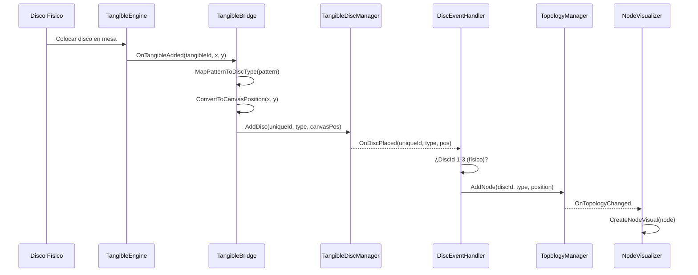
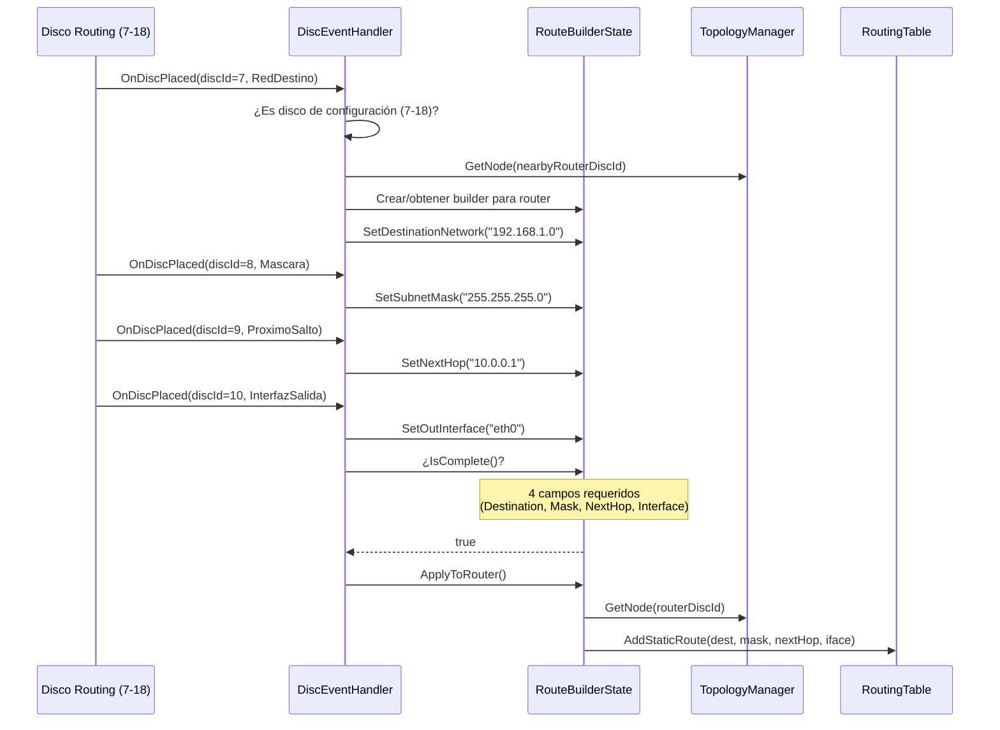
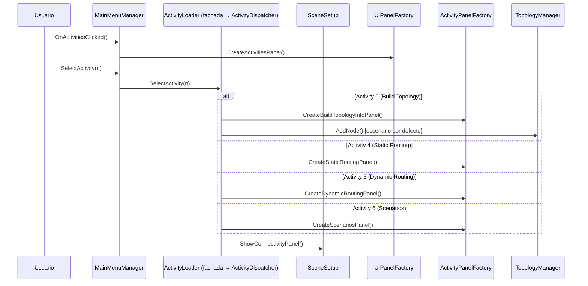
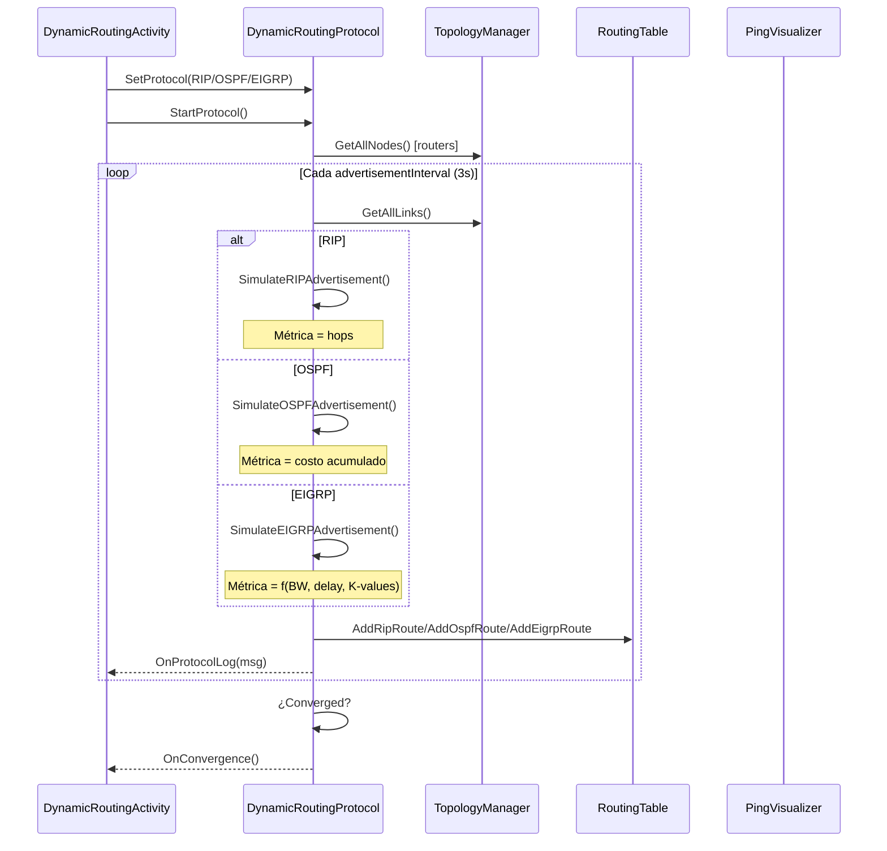
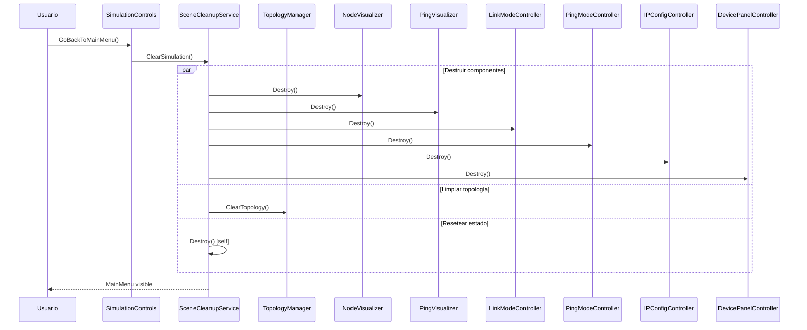
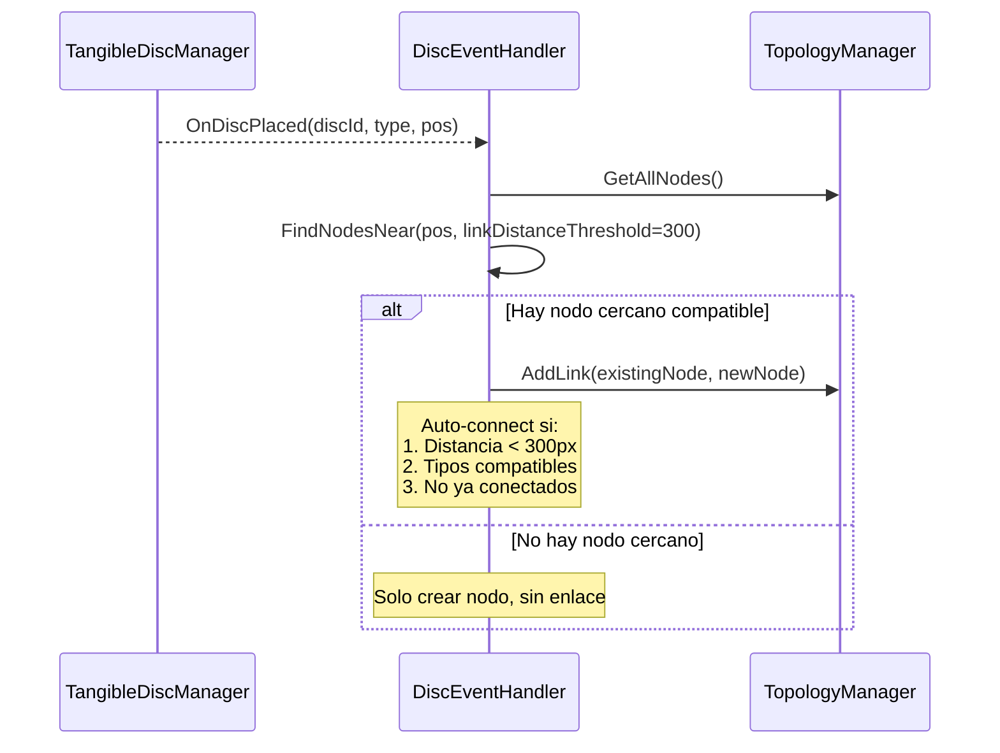
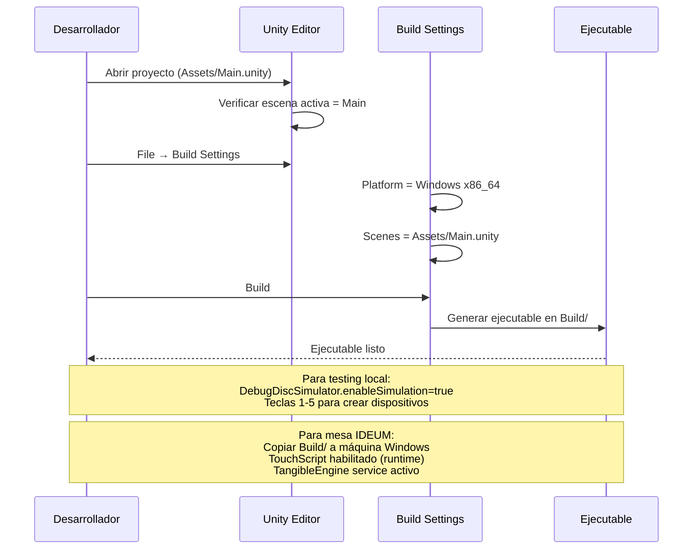
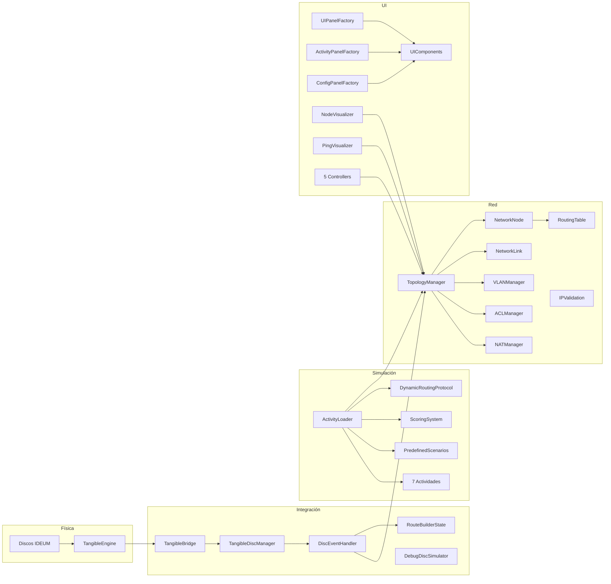

# 07 — Flujos de Datos Arquitectónicos

> **Propósito**: Mostrar cómo fluyen los datos entre capas del sistema en los escenarios más comunes.

---

## Flujo 1: Disco Físico → Nodo en Topología

---

## Flujo 2: Configuración de Routing por Discos (7-18)

---

## Flujo 3: Ping (Prueba de Conectividad)

```mermaid
sequenceDiagram
    participant USER as Usuario
    participant PM as PingModeController
    participant PV as PingVisualizer
    participant TM as TopologyManager
    participant IPV as IPValidation

    USER->>PM: TogglePingMode()
    PM->>PM: isPingModeActive = true
    USER->>TM: HandleNodeClick(srcDiscId)
    TM->>PM: HandlePingNodeClick(srcDiscId)
    PM->>PM: Primer nodo seleccionado
    USER->>TM: HandleNodeClick(dstDiscId)
    TM->>PM: HandlePingNodeClick(dstDiscId)
    PM->>TM: CheckConnectivity(src, dst)

    rect rgb(20, 30, 50)
        Note over TM: 1. BFS: ¿Hay path físico?
        Note over TM: 2. ¿Ambos tienen IP?
        Note over TM: 3. ¿Máscaras válidas?
        Note over TM: 4. ¿Misma subred?
    end

    TM-->>PM: bool connected
    PM->>PV: AnimatePing(src, dst, success)
    PV->>PV: Animación visual del paquete
```

---

## Flujo 4: Inicio de Actividad

---

## Flujo 5: Routing Dinámico (RIP/OSPF/EIGRP)

---

## Flujo 6: Limpieza al Volver al Menú

---

## Flujo 7: Auto-Conexión de Enlaces (Tangible)

---

## Flujo 8: Build y Deploy

---

## Diagrama de Capas con Dependencias

