# KNOWLEDGE-GRAPH — SimuladorRedes IDEUM

> **Nodo raíz** del grafo de conocimiento del proyecto.
> Este archivo conecta toda la información del proyecto en una sola página.
> Úsalo como punto de partida para navegar cualquier parte del código.
>
> **Última actualización**: Agosto 2026 | **Reemplaza**: CODE_INDEX.md (para navegación detallada)
>
> **Obsidian**: Abre esta carpeta como vault. Los links navegan entre archivos. Mermaid se renderiza nativamente.

---

## Grafo Global del Proyecto

```mermaid
graph TB
    subgraph "Network - SimRedes.Network"
        TM[TopologyManager<br/>~25 dependencias]
        NN[NetworkNode<br/>~18 dependencias]
        NL[NetworkLink]
        RT[RoutingTable]
        ARP[ARPTable]
        IPV[IPValidation<br/>~9 dependencias]
        DC[DiscConfiguration]
        VLAN[VLANManager]
        ACL[ACLManager]
        NAT[NATManager]
    end

    subgraph "Tangible - SimRedes.Tangible"
        TDM[TangibleDiscManager]
        TB[TangibleBridge]
        DEH[DiscEventHandler]
        RBS[RouteBuilderState]
        DDS[DebugDiscSimulator]
    end

    subgraph "Simulation - SimRedes.Simulation"
        SS[SceneSetup<br/>~30 dependencias]
        AL[ActivityLoader<br/>~20 dependencias]
        SCS[SceneCleanupService<br/>~18 dependencias]
        BTA[BuildTopologyActivity]
        FFA[FindFaultActivity]
        BRA[BestRouteActivity]
        RTA[RoutingTablesActivity]
        SRA[StaticRoutingActivity]
        DRA[DynamicRoutingActivity]
        DRP[DynamicRoutingProtocol]
        SC[ScoringSystem]
        PRED[PredefinedScenarios]
        RP[RoutingProtocols]
        SIMC[SimulationControls]
    end

    subgraph "UI - SimRedes.UI"
        UPF[UIPanelFactory]
        APF[ActivityPanelFactory]
        CPF[ConfigPanelFactory]
        UIC[UIComponents<br/>~12 dependencias]
        NV[NodeVisualizer<br/>~6 dependencias]
        PV[PingVisualizer<br/>~6 dependencias]
        LM[LinkModeController]
        PM[PingModeController]
        IPC[IPConfigController]
        DPC[DevicePanelController]
        NIC[NodeInteractionController]
        MN[MenuNavigator]
        MMM[MainMenuManager]
        CTP[ConnectivityTestPanel]
    end

    subgraph "Core - SimRedes.Core"
        LOG[AppLogger]
    end

    %% Hub connections (thick)
    TM ==> NN
    TM ==> NL
    TM ==> IPV
    TM ==> VLAN
    TM ==> ACL
    TM ==> NAT
    NN ==> RT
    NN ==> ARP
    NN ==> IPV

    %% Cross-namespace
    SS --> TM
    SS --> AL
    SS --> SCS
    SS --> UPF
    AL --> TM
    AL --> DRP
    AL --> PRED
    DEH --> TM
    DEH --> RBS
    RBS --> RT
    DRP --> TM
    NV --> TM
    PV --> TM
    LM --> TM
    PM --> PV
    IPC --> TM
    DPC --> TM
    NIC --> LM
    NIC --> PM
    NIC --> IPC
    UPF --> UIC
    APF --> UIC
    CPF --> UIC
    SCS --> TM
    SIMC --> TM
```

---

## Tabla de Búsqueda Rápida

| Quiero entender... | Ir a |
|---|---|
| **Dependencias entre archivos** | [01-dependency-graph.md](01-dependency-graph.md) |
| **Conceptos del dominio** | [02-concept-map.md](02-concept-map.md) |
| **Por dónde empezar a modificar** | [03-entry-points.md](03-entry-points.md) |
| **Qué tests cubren qué** | [04-tests-map.md](04-tests-map.md) |
| **Historial de bugs** | [05-bugs-history.md](05-bugs-history.md) |
| **Skills y su alcance** | [06-skills-map.md](06-skills-map.md) |
| **Flujos de datos** | [07-architectural-flows.md](07-architectural-flows.md) |

---

## Hub Nodes (Archivos Más Dependidos)

| Archivo | Dependido por | Namespace |
|---|---|---|
| `TopologyManager.cs` | ~25 archivos | Network |
| `NetworkNode.cs` | ~18 archivos | Network |
| `UIComponents.cs` | ~12 archivos | UI |
| `IPValidation.cs` | ~9 archivos | Network |
| `RoutingTable.cs` | ~6 archivos | Network |
| `PingVisualizer.cs` | ~6 archivos | UI |
| `NodeVisualizer.cs` | ~6 archivos | UI |
| `TangibleDiscManager.cs` | ~5 archivos | Tangible |

---

## Leaf Nodes (Sin Dependencias Proyectadas)

| Archivo | Namespace |
|---|---|
| `IPValidation.cs` | Network |
| `DiscConfiguration.cs` | Network |
| `ACLManager.cs` | Network |
| `NATManager.cs` | Network |
| `TangibleDiscManager.cs` | Tangible |
| `PointerClickHandler.cs` | SimRedes |
| `TouchScriptDisabler.cs` | SimRedes |
| `PredefinedScenarios.cs` | Simulation |
| `ScoringSystem.cs` | Simulation |
| `IDEUMConfigurator.cs` | UI |
| `AppLogger.cs` | Core |

---

## Estadísticas del Proyecto

| Métrica | Valor |
|---|---|
| Scripts fuente | 46 archivos, ~15K líneas |
| Tests EditMode | 328 tests, 21 suites |
| Namespaces | 6 (SimRedes, Network, Tangible, Simulation, UI, Core) |
| Skills | 19 |
| Diagramas | 21 (Mermaid) + 9 (Archify) |
| Documentos API | 9 |
| Documentos requerimientos | 3 (stakeholders, user stories, requirements) |
| Bugs activos | 0 |
| Estructura docs/ | Organizada: api/, manuals/, config/, diagrams/{mermaid,archify}/, knowledge-graph/ |

---

## Diagramas Archify (Interactivos)

> Diagramas HTML autocontenidos con zoom, búsqueda, temas dark/light y export.
> **Preset**: Blueprint | **Guía**: `docs/diagrams/archify/README.md`

### Arquitectura
| Tipo | Diagrama | Archivo HTML |
|------|----------|--------------|
| Architecture | Casos de Uso | [use-cases.architecture.html](../diagrams/archify/rendered/use-cases.architecture.html) |
| Architecture | Despliegue | [deployment.architecture.html](../diagrams/archify/rendered/deployment.architecture.html) |
| Architecture | Componentes | [components.architecture.html](../diagrams/archify/rendered/components.architecture.html) |
| Architecture | Clases Network | [class-network.architecture.html](../diagrams/archify/rendered/class-network.architecture.html) |
| Architecture | Clases UI | [class-ui.architecture.html](../diagrams/archify/rendered/class-ui.architecture.html) |

### Secuencia
| Tipo | Diagrama | Archivo HTML |
|------|----------|--------------|
| Sequence | Routing Config | [routing-config.sequence.html](../diagrams/archify/rendered/routing-config.sequence.html) |

### Workflow (Actividades)
| Tipo | Diagrama | Archivo HTML |
|------|----------|--------------|
| Workflow | Actividad Topología | [activity-topology.workflow.html](../diagrams/archify/rendered/activity-topology.workflow.html) |
| Workflow | Actividad Fallos | [activity-faults.workflow.html](../diagrams/archify/rendered/activity-faults.workflow.html) |
| Workflow | Actividad Dinámico | [activity-dynamic.workflow.html](../diagrams/archify/rendered/activity-dynamic.workflow.html) |

---

## Documentos de Requerimientos

| Archivo | Contenido |
|---------|-----------|
| [`stakeholders.md`](../stakeholders.md) | Stakeholders primarios/secundarios, intereses, matriz poder/interés |
| [`user-stories.md`](../user-stories.md) | 24 historias de usuario con criterios de aceptación |
| [`requirements.md`](../requirements.md) | 20 RF + 10 RNF, matriz de trazabilidad |

---

## Cómo Usar Este Grafo

1. **Navegación por concepto**: Busca en `02-concept-map.md` el concepto que necesitas
2. **Navegación por archivo**: Busca en `01-dependency-graph.md` el archivo y sus conexiones
3. **Navegación por necesidad**: Usa `03-entry-points.md` como punto de entrada
4. **Debugging**: Revisa `05-bugs-history.md` para bugs similares
5. **Tests**: Consulta `04-tests-map.md` para saber qué probar tras un cambio
